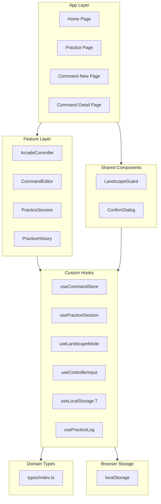
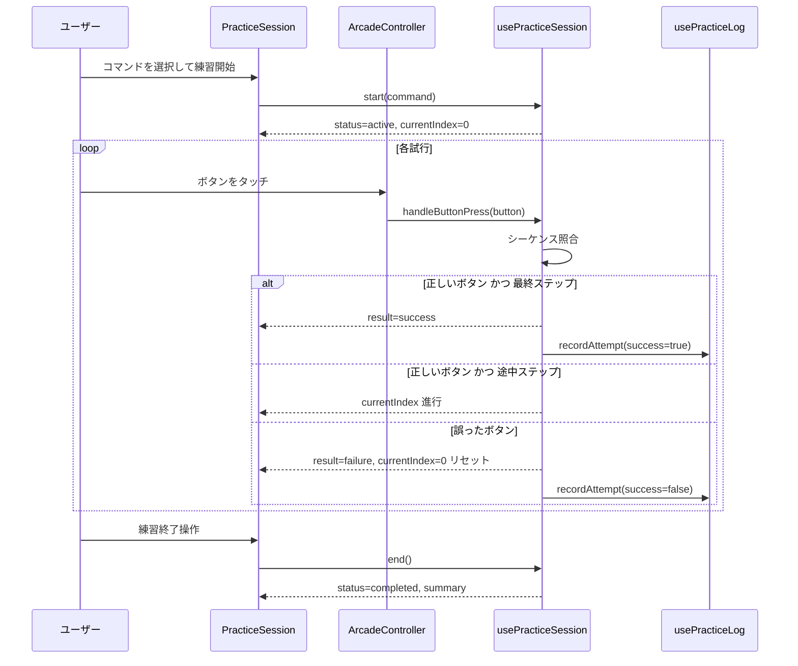
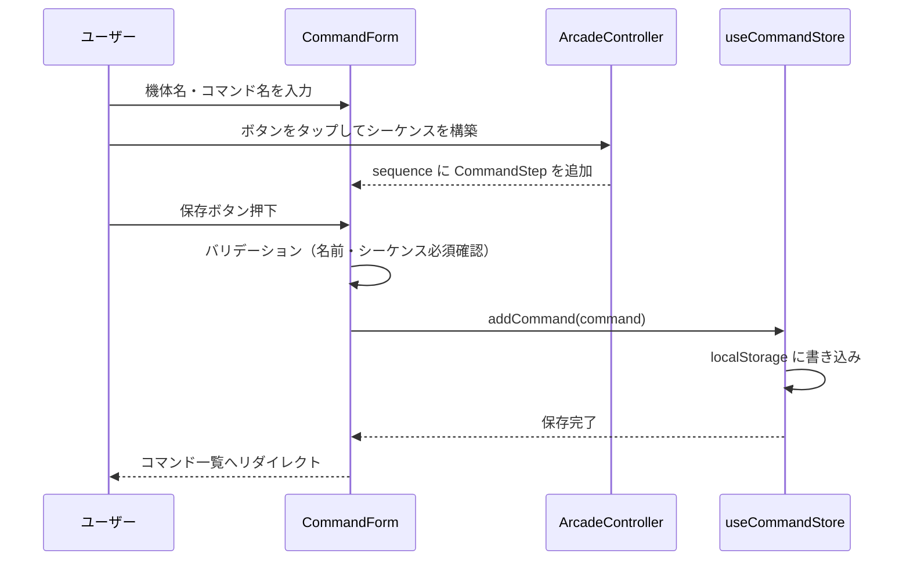
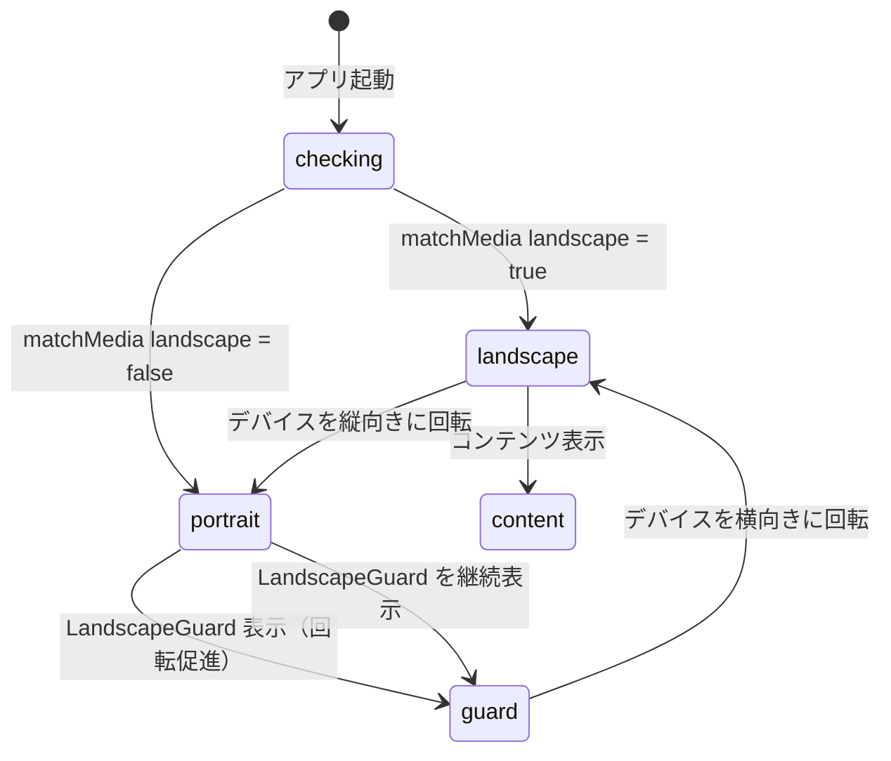
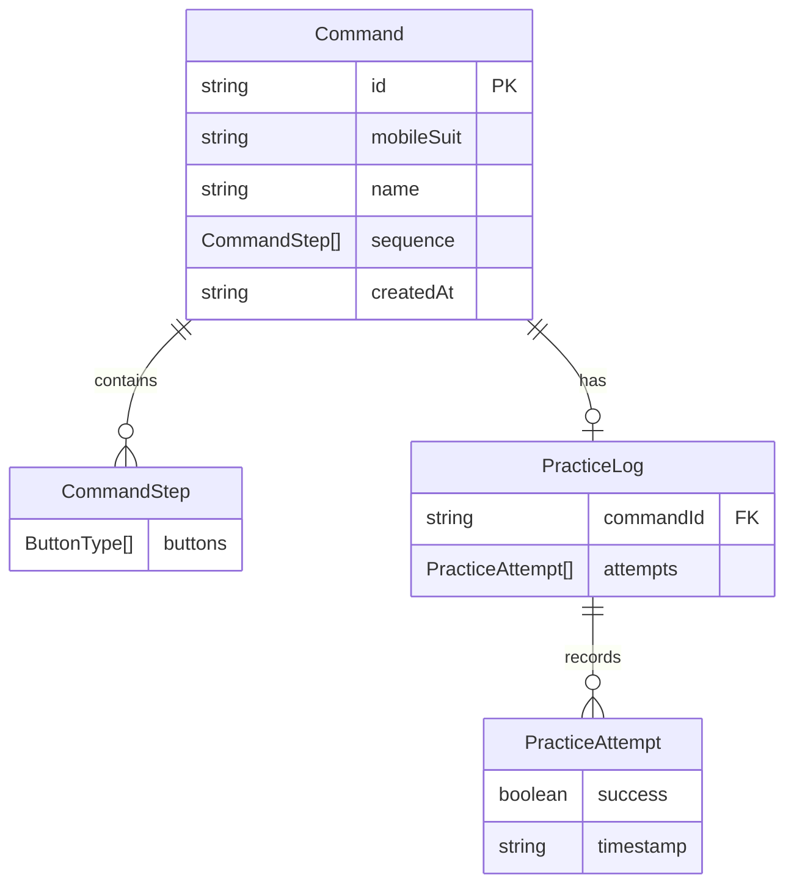

# 技術設計書: command-practice-mvp

## Overview

本フィーチャーは、「機動戦士ガンダム エクストリームバーサス」シリーズのプレイヤーが機体ごとのコマンド（ボタン列）をスマートフォン横画面上で繰り返し練習・習得できる MVP アプリケーションを実現する。アーケードコントローラUIでのタッチ入力・コマンドシーケンス照合・練習ログのローカル永続化という3つの軸でコア体験を完結させる。

ユーザーはコマンドを登録し、アーケードコントローラを模したUIで入力練習を行い、成功/失敗の即時フィードバックと練習履歴を通じて上達を実感できる。外部バックエンド（Firebase）や認証機能は本フィーチャーのスコープ外とし、ローカルストレージのみで動作する。

### Goals

- 射撃・格闘・ジャンプ・覚醒の4ボタンをタッチ入力できるアーケードコントローラUIを提供する
- 機体ごとにコマンド（ボタン列）を登録・管理できるコマンドエディタを提供する
- コマンド照合（成功/失敗判定）と練習ログを持つ練習セッション機能を提供する
- スマートフォン横画面（landscape）ファーストのレイアウトを実現する

### Non-Goals

- ユーザー認証・アカウント管理
- Firebase / Firestore 連携（将来フェーズ）
- ランキング・スコア公開
- タイミング計測・フレームカウント（ズンダの「ディレイズンダ」等の高精度判定）
- 対戦記録・リプレイ機能

---

## Boundary Commitments

### This Spec Owns

- アーケードコントローラUI（ボタン表示・タッチ入力・視覚フィードバック）
- コマンドデータ（`Command`）の CRUD とローカルストレージへの永続化
- 練習セッションのコマンドシーケンス照合ロジック
- 練習ログ（`PracticeLog`）のローカルストレージへの記録と読み出し
- 横画面判定と縦画面時のガード表示
- `src/types/`, `src/hooks/`, `src/features/`, `src/app/` のファイル構造（初期実装分）

### Out of Boundary

- Firebase / Firestore へのデータ移行（別スペック）
- ユーザー認証・セッション管理（別スペック）
- ランキング機能（別スペック）
- フレーム単位のタイミング判定（将来の高度練習モード）

### Allowed Dependencies

- Next.js App Router（フレームワーク）
- React（UIライブラリ）
- TypeScript strict モード
- ブラウザ標準 API（Pointer Events, localStorage, matchMedia）
- `src/components/`・`src/hooks/`・`src/types/`（共有レイヤー）

### Revalidation Triggers

- `ButtonType` 型に新しいボタンを追加した場合、コントローラUIとデータモデルの双方を更新する必要がある
- `Command` または `PracticeLog` のスキーマ変更は localStorage のマイグレーション戦略を伴う
- Firebase 連携スペックが実装された場合、`useCommandStore`・`usePracticeLog` のインターフェースを互換性を保って拡張する

---

## Architecture

### Architecture Pattern & Boundary Map

フィーチャーファーストのクライアントサイド SPA。ステアリング（`structure.md`）に従い、`src/features/` を最上位ドメインとして配置する。依存方向は以下の通りに一方向に制限する：

```
Types → Hooks → Features/Components → App Routes
```

各レイヤーは右方向（呼び出し元方向）のみをインポートできる。`features/A` が `features/B` をインポートすることは禁止。



### Technology Stack

| レイヤー | 技術・バージョン | 本フィーチャーでの役割 | 備考 |
|---------|--------------|---------------------|------|
| フレームワーク | Next.js App Router (latest) | ルーティング、SSR/CSR 制御 | `'use client'` ディレクティブをフィーチャーコンポーネントに付与 |
| UI | React 19 | コンポーネントツリー、状態管理 | `useReducer` で練習セッション状態を管理 |
| 言語 | TypeScript strict | 全型定義・インターフェース | `any` 使用禁止、ジェネリクス積極活用 |
| タッチ入力 | Pointer Events API（ブラウザ標準） | マルチタッチ入力検出 | `touch-action: none` と `pointerId` 追跡 |
| データ永続化 | localStorage（ブラウザ標準） | コマンド・練習ログの保存 | SSR 安全な `useLocalStorage<T>` フック経由 |
| 向き検出 | `matchMedia`（ブラウザ標準） | 横/縦画面判定 | Safari の `screen.orientation` 非対応を回避 |
| スタイリング | CSS Modules または Tailwind CSS（TBD） | レイアウト・ボタンスタイル | 横画面メディアクエリを使用 |

---

## File Structure Plan

### Directory Structure

```
src/
├── types/
│   └── index.ts               # ドメイン型（ButtonType, Command, PracticeLog 等）
│
├── hooks/
│   ├── useLocalStorage.ts     # ジェネリック SSR 安全 localStorage フック
│   ├── useCommandStore.ts     # コマンドの CRUD（useLocalStorage を使用）
│   ├── usePracticeLog.ts      # 練習ログの読み書き（useLocalStorage を使用）
│   ├── useLandscapeMode.ts    # 横画面判定（matchMedia ベース）
│   ├── useControllerInput.ts  # Pointer Events マルチタッチ追跡
│   └── usePracticeSession.ts  # 練習セッション状態マシン（useReducer）
│
├── components/
│   ├── LandscapeGuard.tsx     # 縦画面時のガード・回転促進UI
│   └── ConfirmDialog.tsx      # 削除確認モーダル
│
├── features/
│   ├── arcade-controller/
│   │   ├── ArcadeController.tsx  # コントローラUI全体（ボタン配置）
│   │   └── ControllerButton.tsx  # 個別ボタン（Pointer Events ハンドラ付き）
│   │
│   ├── command-editor/
│   │   ├── CommandList.tsx       # 機体ごとにグループ化したコマンド一覧
│   │   ├── CommandForm.tsx       # コマンド登録フォーム（ArcadeController を内包）
│   │   └── CommandDetail.tsx     # コマンド詳細表示
│   │
│   ├── practice/
│   │   ├── PracticeSession.tsx   # 練習セッションのコンテナ
│   │   ├── CommandHint.tsx       # 次に押すべきボタンのハイライト表示
│   │   └── SessionResult.tsx     # セッション終了後のサマリ表示
│   │
│   └── practice-history/
│       └── PracticeHistory.tsx   # コマンドごとの練習履歴一覧
│
└── app/
    ├── page.tsx                  # ホーム（コマンド一覧）
    ├── commands/
    │   ├── new/
    │   │   └── page.tsx          # コマンド登録ページ
    │   └── [id]/
    │       └── page.tsx          # コマンド詳細・練習開始ページ
    └── practice/
        └── [commandId]/
            └── page.tsx          # 練習セッションページ
```

---

## System Flows

### 練習セッションフロー



### コマンド登録フロー



### 向き検出フロー



---

## Requirements Traceability

| 要件 | 概要 | コンポーネント | インターフェース | フロー |
|------|------|--------------|---------------|------|
| 1.1 | アクションボタン配置 | `ArcadeController` | `ArcadeControllerProps` | — |
| 1.2 | ボタンタッチ登録・視覚フィードバック | `ControllerButton`, `useControllerInput` | `UseControllerInputReturn` | 練習セッションフロー |
| 1.3 | 横画面での全ボタン表示 | `ArcadeController` + CSS | — | 向き検出フロー |
| 1.4 | 縦画面時のガード表示 | `LandscapeGuard`, `useLandscapeMode` | `UseLandscapeModeReturn` | 向き検出フロー |
| 1.5 | 横画面促進メッセージ | `LandscapeGuard` | — | — |
| 1.6 | マルチタッチ同時押し | `useControllerInput` | `UseControllerInputReturn` | — |
| 1.7 | 論理→実座標変換 | `useControllerInput` | — | — |
| 2.1 | コマンド登録・localStorage 保存 | `CommandForm`, `useCommandStore` | `UseCommandStoreReturn` | コマンド登録フロー |
| 2.2 | 機体別コマンド一覧 | `CommandList` | — | — |
| 2.3 | コマンド選択→詳細表示 | `CommandDetail` | — | — |
| 2.4 | コマンド削除・確認 | `CommandList`, `ConfirmDialog`, `useCommandStore` | `UseCommandStoreReturn` | — |
| 2.5 | localStorage 書き込みエラー時の通知 | `useCommandStore` | `UseCommandStoreReturn` | — |
| 2.6 | 入力バリデーション | `CommandForm` | — | — |
| 3.1 | 目標コマンドの参照表示 | `PracticeSession`, `CommandHint` | — | 練習セッションフロー |
| 3.2 | リアルタイム入力追跡 | `usePracticeSession`, `useControllerInput` | `UsePracticeSessionReturn` | 練習セッションフロー |
| 3.3 | 成功判定・インジケータ・ログ記録 | `usePracticeSession`, `PracticeSession` | `UsePracticeSessionReturn` | 練習セッションフロー |
| 3.4 | 失敗判定・インジケータ・ログ記録 | `usePracticeSession`, `PracticeSession` | `UsePracticeSessionReturn` | 練習セッションフロー |
| 3.5 | 試行後の自動リセット | `usePracticeSession` | — | — |
| 3.6 | セッション終了操作 | `PracticeSession`, `SessionResult` | — | — |
| 4.1 | 次のボタンハイライト | `CommandHint` | `CommandHintProps` | — |
| 4.2 | 正解時のハイライト進行 | `usePracticeSession` → `CommandHint` | — | — |
| 4.3 | 誤入力時のハイライトリセット | `usePracticeSession` → `CommandHint` | — | — |
| 5.1 | セッション中の試行回数・成功数表示 | `PracticeSession` | — | — |
| 5.2 | セッション終了後のサマリ | `SessionResult` | `SessionResultProps` | — |
| 5.3 | コマンドごとの練習履歴 | `PracticeHistory`, `usePracticeLog` | `UsePracticeLogReturn` | — |
| 5.4 | 練習履歴なし時のメッセージ | `PracticeHistory` | — | — |

---

## Components and Interfaces

### Component Summary

| コンポーネント | ドメイン/レイヤー | Intent | 要件 | Key Dependencies | Contracts |
|--------------|----------------|--------|------|-----------------|-----------|
| `ArcadeController` | Feature / UI | ボタン配置・入力受付コンテナ | 1.1, 1.3, 1.6 | `ControllerButton`, `useControllerInput` | Props |
| `ControllerButton` | Feature / UI | 個別ボタン・タッチフィードバック | 1.2 | Pointer Events API | Props |
| `LandscapeGuard` | Shared / UI | 縦画面ガード・回転促進UI | 1.4, 1.5 | `useLandscapeMode` | Props |
| `CommandList` | Feature / UI | 機体別コマンド一覧・削除 | 2.2, 2.4 | `useCommandStore`, `ConfirmDialog` | Props |
| `CommandForm` | Feature / UI | コマンド登録フォーム | 2.1, 2.6 | `useCommandStore`, `ArcadeController` | Props |
| `CommandDetail` | Feature / UI | コマンド詳細表示 | 2.3 | — | Props |
| `PracticeSession` | Feature / UI | 練習セッションコンテナ | 3.1〜3.6, 5.1 | `usePracticeSession`, `ArcadeController`, `CommandHint` | Props |
| `CommandHint` | Feature / UI | 次ボタンハイライト | 4.1〜4.3 | — | Props |
| `SessionResult` | Feature / UI | セッション終了サマリ | 5.2 | — | Props |
| `PracticeHistory` | Feature / UI | 練習履歴一覧 | 5.3, 5.4 | `usePracticeLog` | Props |
| `useLocalStorage<T>` | Hook | SSR 安全 localStorage アクセス | 2.1, 2.5 | localStorage | Service |
| `useCommandStore` | Hook | コマンド CRUD | 2.1〜2.6 | `useLocalStorage<T>` | Service |
| `usePracticeLog` | Hook | 練習ログ読み書き | 3.3, 3.4, 5.3, 5.4 | `useLocalStorage<T>` | Service |
| `useLandscapeMode` | Hook | 横画面状態検出 | 1.4, 1.5 | matchMedia API | Service |
| `useControllerInput` | Hook | マルチタッチ Pointer Events 追跡 | 1.2, 1.6, 1.7 | Pointer Events API | Service |
| `usePracticeSession` | Hook | 練習セッション状態マシン | 3.2〜3.5, 4.2, 4.3 | `usePracticeLog` | Service |

---

### Domain Types Layer

#### `src/types/index.ts`

| Field | Detail |
|-------|--------|
| Intent | アプリ全体のドメイン型定義。全コンポーネント・フックが参照する単一の型定義源 |
| Requirements | 全要件の基盤 |

**型定義**

```typescript
/** アーケードコントローラのボタン種別 */
type ButtonType = 'shot' | 'melee' | 'jump' | 'awaken';

/** コマンドの1ステップ（同時押し含む） */
type CommandStep = {
  /** 同時に押すボタンの集合。単押しは要素数1 */
  buttons: ButtonType[];
};

/** 登録済みコマンド */
type Command = {
  id: string;
  mobileSuit: string;
  name: string;
  sequence: CommandStep[];
  createdAt: string;
};

/** 1回の練習試行結果 */
type PracticeAttempt = {
  success: boolean;
  timestamp: string;
};

/** コマンドごとの練習ログ */
type PracticeLog = {
  commandId: string;
  attempts: PracticeAttempt[];
};

/** 練習セッションの状態 */
type PracticeSessionStatus = 'idle' | 'active' | 'completed';

/** 練習セッション内部状態 */
type PracticeSessionState = {
  status: PracticeSessionStatus;
  /** 照合対象のコマンド（active 時のみ非 null） */
  command: Command | null;
  /** 次に照合すべきステップのインデックス */
  currentIndex: number;
  /** セッション内の試行一覧 */
  attempts: PracticeAttempt[];
  /** 直前の試行結果 */
  lastResult: 'success' | 'failure' | null;
};
```

**Contracts**: State [ ✓ ]

---

### Hooks Layer

#### `useLocalStorage<T>`

| Field | Detail |
|-------|--------|
| Intent | SSR 安全なジェネリック localStorage アクセスプリミティブ |
| Requirements | 2.1, 2.5 |

**Responsibilities & Constraints**
- `useEffect` 内でのみ `window.localStorage` にアクセスし、SSR フェーズでは `defaultValue` を返す
- JSON のシリアライズ・デシリアライズを内部で処理する
- 書き込みエラー（QuotaExceededError 等）を `StorageError` として返す

**Dependencies**
- External: `localStorage` ブラウザ API（P0）

**Contracts**: Service [ ✓ ]

##### Service Interface

```typescript
type StorageError = {
  type: 'quota_exceeded' | 'parse_error' | 'write_error';
  message: string;
};

type StorageResult<T> =
  | { ok: true; value: T }
  | { ok: false; error: StorageError };

interface UseLocalStorageReturn<T> {
  /** 現在の値。hydration 前は defaultValue */
  value: T;
  /** 値を更新し localStorage に書き込む */
  setValue(newValue: T): StorageResult<T>;
  /** localStorage から削除し defaultValue に戻す */
  removeValue(): void;
  /** hydration 完了前は true */
  isLoading: boolean;
}

function useLocalStorage<T>(key: string, defaultValue: T): UseLocalStorageReturn<T>;
```

- Preconditions: `key` は空文字列でないこと
- Postconditions: `setValue` 呼び出し後、`value` が新しい値に更新される
- Invariants: SSR フェーズでは `value === defaultValue`、`isLoading === true`

**Implementation Notes**
- Integration: `useEffect` で mount 後に localStorage を読み込み、`useState` を更新する
- Validation: JSON.parse の例外を catch して `StorageResult` に変換する
- Risks: QuotaExceededError は Safari プライベートブラウジングで頻発する可能性がある

---

#### `useCommandStore`

| Field | Detail |
|-------|--------|
| Intent | コマンドデータの CRUD を localStorage 経由で提供するドメインフック |
| Requirements | 2.1, 2.2, 2.3, 2.4, 2.5, 2.6 |

**Dependencies**
- Outbound: `useLocalStorage<Command[]>` — データ永続化（P0）

**Contracts**: Service [ ✓ ]

##### Service Interface

```typescript
interface UseCommandStoreReturn {
  /** 全登録コマンド */
  commands: Command[];
  /** hydration 前は true */
  isLoading: boolean;
  /** 最新の書き込みエラー（なければ null） */
  lastError: StorageError | null;
  /** コマンドを追加。id と createdAt は内部で生成 */
  addCommand(input: Omit<Command, 'id' | 'createdAt'>): StorageResult<Command>;
  /** 指定 id のコマンドを削除 */
  removeCommand(id: string): StorageResult<void>;
  /** 指定 id のコマンドを返す（存在しない場合は undefined） */
  getCommand(id: string): Command | undefined;
  /** 機体名でフィルタ */
  getCommandsByMobileSuit(mobileSuit: string): Command[];
}
```

- Preconditions: `addCommand` では `mobileSuit`, `name`, `sequence.length >= 1` が必須
- Postconditions: `addCommand` 成功後、`commands` に新コマンドが含まれる
- Invariants: `commands` は常に `ct_commands` localStorage キーの内容と一致する

---

#### `usePracticeLog`

| Field | Detail |
|-------|--------|
| Intent | 練習ログ（`PracticeLog`）の読み書きを提供するドメインフック |
| Requirements | 3.3, 3.4, 5.3, 5.4 |

**Dependencies**
- Outbound: `useLocalStorage<Record<string, PracticeLog>>` — ログ永続化（P0）

**Contracts**: Service [ ✓ ]

##### Service Interface

```typescript
interface UsePracticeLogReturn {
  /** 指定コマンドの練習ログ（存在しない場合は null） */
  getLog(commandId: string): PracticeLog | null;
  /** 試行結果を記録 */
  recordAttempt(commandId: string, attempt: PracticeAttempt): StorageResult<void>;
  /** 指定コマンドのログを全削除 */
  clearLog(commandId: string): void;
  isLoading: boolean;
  lastError: StorageError | null;
}
```

---

#### `useLandscapeMode`

| Field | Detail |
|-------|--------|
| Intent | `matchMedia` を使ったリアクティブな横画面状態検出 |
| Requirements | 1.3, 1.4 |

**Dependencies**
- External: `window.matchMedia`（P0）

**Contracts**: Service [ ✓ ]

##### Service Interface

```typescript
interface UseLandscapeModeReturn {
  /** 現在横画面なら true（hydration 前は null） */
  isLandscape: boolean | null;
}

function useLandscapeMode(): UseLandscapeModeReturn;
```

- Invariants: `matchMedia("(orientation: landscape)")` の結果をリアクティブに反映する。Safari の `screen.orientation` は使用しない

---

#### `useControllerInput`

| Field | Detail |
|-------|--------|
| Intent | Pointer Events を使ったマルチタッチ入力追跡。論理座標系変換は行わず、ボタンごとの `pointerId` セットで管理する |
| Requirements | 1.2, 1.6, 1.7 |

**Dependencies**
- External: Pointer Events API（P0）

**Contracts**: Service [ ✓ ]

##### Service Interface

```typescript
type PointerHandlers = {
  onPointerDown(event: React.PointerEvent<HTMLElement>): void;
  onPointerUp(event: React.PointerEvent<HTMLElement>): void;
  onPointerCancel(event: React.PointerEvent<HTMLElement>): void;
};

interface UseControllerInputReturn {
  /** 現在押下中のボタンセット */
  activeButtons: ReadonlySet<ButtonType>;
  /** 各ボタンコンポーネントに渡すイベントハンドラファクトリ */
  getButtonHandlers(button: ButtonType): PointerHandlers;
  /** ボタン押下イベントのコールバック（PracticeSession が練習中に登録） */
  onButtonPress: ((button: ButtonType) => void) | null;
  setOnButtonPress(callback: ((button: ButtonType) => void) | null): void;
}
```

- Preconditions: ボタン要素に `touch-action: none` の CSS が設定されていること
- Invariants: `activeButtons` には `pointerdown` で追加、`pointerup`/`pointercancel` で削除される

---

#### `usePracticeSession`

| Field | Detail |
|-------|--------|
| Intent | 練習セッションのライフサイクルとコマンドシーケンス照合ロジックを持つ状態マシン |
| Requirements | 3.2, 3.3, 3.4, 3.5, 4.2, 4.3 |

**Dependencies**
- Outbound: `usePracticeLog` — 試行結果の記録（P0）

**Contracts**: Service [ ✓ ]

##### Service Interface

```typescript
interface UsePracticeSessionReturn {
  state: PracticeSessionState;
  /** セッション開始。コマンドを受け取りステータスを active に移行 */
  start(command: Command): void;
  /** セッション終了。ステータスを completed に移行 */
  end(): void;
  /**
   * ボタン押下を受け取り、シーケンス照合を実行する。
   * ArcadeController の onButtonPress から呼び出される
   */
  handleButtonPress(button: ButtonType): void;
}
```

- Preconditions: `handleButtonPress` は `status === 'active'` の場合のみ照合処理を行う
- Postconditions: 成功時 `lastResult = 'success'`、`currentIndex = 0` にリセット。失敗時 `lastResult = 'failure'`、`currentIndex = 0` にリセット
- Invariants: `status === 'idle'` の間は `command === null`、`attempts === []`

**Implementation Notes**
- Integration: `useReducer` で `PracticeSessionState` を管理する。ステップ照合は「押下ボタンセット ⊇ 現在ステップのボタン集合」の部分集合判定で行う（同時押し対応）
- Risks: `handleButtonPress` はレンダリングループ外（Pointer Events ハンドラ内）から呼ばれるため、`useCallback` でメモ化する

---

### Feature Layer

#### ArcadeController

| Field | Detail |
|-------|--------|
| Intent | アーケードコントローラUIのレイアウトコンテナ。ボタン配置と `useControllerInput` を統合する |
| Requirements | 1.1, 1.3, 1.6 |

**Contracts**: Props のみ

##### Props Interface

```typescript
interface ArcadeControllerProps {
  /** 練習セッション中に呼ばれるコールバック（コマンド登録モードでは undefined） */
  onButtonPress?: (button: ButtonType) => void;
  /** コマンド登録モード時に構築中のシーケンスを受け取るコールバック */
  onStepAdded?: (step: CommandStep) => void;
  /** ハイライトするボタン（CommandHint から渡される） */
  highlightedButton?: ButtonType | null;
  /** 現在押下中のボタン（ControllerButton のスタイル制御用） */
  activeButtons?: ReadonlySet<ButtonType>;
}
```

**Implementation Notes**
- Integration: `useControllerInput` を内部で使用し、`onButtonPress`/`onStepAdded` を `setOnButtonPress` に渡す
- Risks: コマンド登録モードと練習モードを同一コンポーネントが担うため、`onButtonPress` と `onStepAdded` は排他的に使用される（両方渡した場合は `onButtonPress` を優先）

---

#### CommandHint

| Field | Detail |
|-------|--------|
| Intent | 練習中に目標コマンドの現在ステップ（次に押すべきボタン）を視覚的に表示する |
| Requirements | 4.1, 4.2, 4.3 |

##### Props Interface

```typescript
interface CommandHintProps {
  sequence: CommandStep[];
  /** 現在ハイライトすべきステップのインデックス（0-based） */
  currentIndex: number;
}
```

---

#### SessionResult

| Field | Detail |
|-------|--------|
| Intent | 練習セッション終了後のサマリ（試行数・成功数・成功率）を表示する |
| Requirements | 5.2 |

##### Props Interface

```typescript
interface SessionResultProps {
  attempts: PracticeAttempt[];
  commandName: string;
  onRetry: () => void;
  onExit: () => void;
}
```

---

#### LandscapeGuard

| Field | Detail |
|-------|--------|
| Intent | 縦画面時にコンテンツをブロックし、横画面への回転を促すメッセージを表示する |
| Requirements | 1.4, 1.5 |

##### Props Interface

```typescript
interface LandscapeGuardProps {
  children: React.ReactNode;
}
```

**Implementation Notes**
- Integration: `useLandscapeMode` を内部で使用。`isLandscape === null`（hydration 前）の場合は children を表示して CLS を防ぐ

---

## Data Models

### Domain Model



### Logical Data Model

**ビジネスルール・不変条件**:
- `Command.sequence.length >= 1`（空シーケンスは無効）
- `CommandStep.buttons.length >= 1`（空ステップは無効）
- `Command.id` は UUID v4 形式で `useCommandStore` 内で生成する
- `PracticeLog.commandId` は必ず存在する `Command.id` と対応する（参照整合性はアプリケーション層で保証）

### Physical Data Model

**localStorage スキーマ**:

| キー | 型 | 説明 |
|------|----|------|
| `ct_commands` | `Command[]` | 全登録コマンドの配列（JSON 文字列） |
| `ct_practice_logs` | `Record<string, PracticeLog>` | commandId をキーとした練習ログマップ（JSON 文字列） |

- スキーマバージョニングは MVP 段階では省略。Firebase 移行時に migration hook を追加する
- `Command` 削除時、対応する `PracticeLog` も `ct_practice_logs` から削除する（孤立データ防止）

---

## Error Handling

### Error Strategy

全エラーをユーザー操作可能なフィードバックに変換する。localStorage エラーは `StorageResult` 型でフック境界から通知し、UI 層が表示責任を持つ。

### Error Categories and Responses

**ユーザー入力エラー**:
- コマンド登録時にシーケンスが空: `CommandForm` が保存ボタンを無効化し、フィールドレベルのバリデーションメッセージを表示（2.6）
- 機体名・コマンド名が未入力: 同上

**システムエラー（localStorage）**:
- QuotaExceededError: `useLocalStorage` が `StorageResult<{ ok: false; error: StorageError }>` を返す。`useCommandStore`・`usePracticeLog` が `lastError` に格納し、UI コンポーネントがトーストまたはインラインメッセージで通知する（2.5）
- JSON.parse エラー: localStorage のデータが破損している場合は `defaultValue` にフォールバックし、`StorageError` を通知する

**向き関連**:
- 縦画面での起動: `LandscapeGuard` が回転促進UIを表示。コンテンツはブロック（1.4）

### Monitoring

MVP 段階では外部モニタリングサービスは使用しない。エラーは `console.error` に出力するにとどめる。

---

## Testing Strategy

### Unit Tests

- `useLocalStorage<T>`: SSR 環境（`window` undefined）での `defaultValue` 返却、書き込み成功、QuotaExceededError のエラーハンドリング
- `useCommandStore`: `addCommand`（正常・バリデーション失敗・ストレージエラー）、`removeCommand`、`getCommandsByMobileSuit`
- `usePracticeSession`: `handleButtonPress` のシーケンス照合（成功・失敗・途中ステップ進行）、`start`/`end` のステータス遷移
- `usePracticeLog`: `recordAttempt` の追記、`getLog` の存在・非存在ケース

### Integration Tests

- `CommandForm` → `useCommandStore` → localStorage：コマンド登録の End-to-End
- `PracticeSession` → `usePracticeSession` → `usePracticeLog`：練習セッション完了とログ記録
- `LandscapeGuard` → `useLandscapeMode`：matchMedia のモックによる縦/横切り替え

### E2E/UI Tests

- ズンダコマンド（ジャンプ→ジャンプ→射撃）を登録し、練習で成功するパス
- コマンド一覧に登録コマンドが機体名グループで表示されること
- 削除確認ダイアログでキャンセルした場合コマンドが残ること
- 練習終了後のサマリ画面で成功率が正しく計算されること

---

## Performance & Scalability

- `useControllerInput` の Pointer Events ハンドラは `useCallback` でメモ化し、不要な再レンダリングを防ぐ
- `usePracticeSession` の `handleButtonPress` は `useReducer` の dispatch を呼ぶことで状態更新をバッチ処理する
- 練習ログが蓄積しても localStorage の読み書きは同期処理のため、1000件程度では問題なし。データ量が増大した場合は Firebase 移行フェーズで対処する

---

## Supporting References

- プロトタイプ実装 `prototype/prototype.js` — ズンダ状態マシン・ボタン座標系変換の参考実装
- research.md — Pointer Events 採用根拠、localStorage パターン選定、FSM アプローチ比較の詳細
