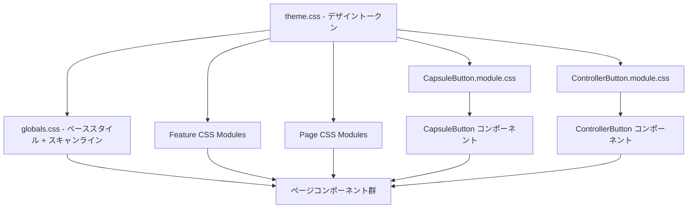
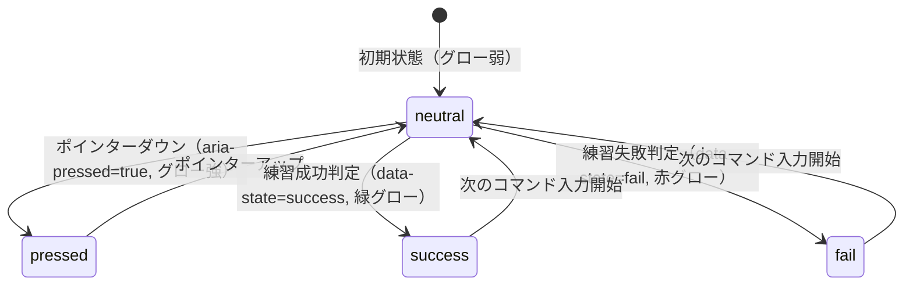

# Technical Design Document: cyberpunk-ui-theme

## Overview

本フィーチャーは、エクバコマンド練習アプリ（コマンドトレーナー）の全UIを「エクストリームバーサス公式サイト」のビジュアルを参照したメカゲームHUDスタイルへ刷新する。ディープネイビー背景・横スキャンラインテクスチャ・カプセル型メタリックボタン（両端シアンキャップ）・ネオングロー効果・太字ゆったり字間テキストを基軸とする。

実装は**純粋なスタイリング層**の変更であり、ビジネスロジック・フック・データ構造には一切触れない。CSS Custom Properties によるデザイントークン基盤を新規構築し、既存 CSS Modules を更新・拡充する。

**対象ユーザー**：コマンドトレーナーを利用するプレイヤー。ゲームの世界観と一体感のあるビジュアルにより、没入感と練習体験の品質が向上する。

### Goals
- EXVS 参照の青系サイバーパンクカラーパレットを CSS Custom Properties（デザイントークン）として `src/styles/` に一元構築する
- カプセル型メタリックボタン（両端シアンキャップ）を共有コンポーネント `CapsuleButton` として提供する
- アーケードコントローラボタンにネオングロー効果・状態別色フィードバックを追加する
- CSS のみで横スキャンラインテクスチャを実装し、`prefers-reduced-motion` に対応する
- スマートフォン横画面（landscape）のレイアウト整合性を維持する

### Non-Goals
- React コンポーネントのロジック・フック・データ構造の変更
- CSS フレームワーク（Tailwind, styled-components 等）の導入
- 新規機能ページ・ルートの追加
- アクセシビリティセマンティクス（ARIAロール等）の変更
- Firebase 連携

## Boundary Commitments

### This Spec Owns
- `next/src/styles/theme.css`（CSS Custom Properties の単一ソース・オブ・トゥルース）
- `next/src/app/globals.css` の全面的な更新（背景・スキャンライン・タイポグラフィ基盤・モーション制御）
- `CapsuleButton` 共有コンポーネント（`src/components/`）の新規追加
- 既存 CSS Modules の更新および CSS モジュールを持たないコンポーネントへの新規 CSS モジュール追加
- `next/src/app/layout.tsx` のメタデータ更新（title, lang）

### Out of Boundary
- フック動作・状態管理・データフロー
- ルート構造・ナビゲーションロジック
- テストファイルの変更（ビジュアル変更に伴うテストの動作確認は実施するが、テストロジックの変更はしない）
- Firebaseとの連携

### Allowed Dependencies
- `next/font/google`（Geist / Geist_Mono：既存ロード済み）
- CSS Modules（既存パターン）
- 新規 npm パッケージなし

### Revalidation Triggers
- CSS 変数名の変更（既存コンポーネントが参照する場合にビルドエラーまたはビジュアル崩れを引き起こす）
- `CapsuleButton` の props インターフェース変更
- `ControllerButton` の `data-button`・`aria-pressed`・`data-highlighted` 属性の変更

## Architecture

### Existing Architecture Analysis

| 項目 | 現状 |
|------|------|
| グローバル CSS | `globals.css`：2変数のみ（`--background`, `--foreground`）。`prefers-color-scheme` でライト/ダーク切り替え |
| コンポーネントスタイリング | CSS Modules（`.module.css`）：6ファイル存在。8コンポーネントは CSS モジュールなし |
| フォント | `Geist` + `Geist_Mono` を `layout.tsx` でロード。CSS 変数 `--font-geist-sans`, `--font-geist-mono` として利用可能 |
| `src/styles/` | 未存在。新規作成が必要 |
| ControllerButton の色 | `data-button` 属性セレクタで直接 background を定義 |

### Architecture Pattern & Boundary Map



**依存方向**：`ThemeCSS` → `GlobalCSS` / CSS Modules → コンポーネント → ページ。上位レイヤーへの逆参照は不可。

**アーキテクチャ選定**：
- `src/styles/theme.css` を新規作成し、`globals.css` から `@import` する（詳細は `research.md` 参照）
- CSS Modules は引き続き `var(--token-name)` を使用（ファイル `@import` 不要。`:root` からカスケードで取得）
- `CapsuleButton` 共有コンポーネント化：両端シアンキャップは疑似要素依存のため HTML 構造の一貫性が必要

### Technology Stack

| Layer | Choice / Version | Role in Feature |
|-------|-----------------|-----------------|
| Styling | CSS Modules（既存） | コンポーネントスコープのスタイル |
| Design Tokens | CSS Custom Properties | `theme.css` でグローバルトークン定義 |
| Font | Geist Mono（既存ロード済み） | 見出し・ボタンラベルのモノスペースフォント |
| Animation | CSS `@keyframes` | ネオンパルス・フラッシュアニメーション |
| Build | Next.js 16.2.4（既存） | 変更なし |

新規 npm 依存なし。

## File Structure Plan

### Directory Structure

```
next/src/
├── styles/
│   └── theme.css                         # NEW: デザイントークン（CSS カスタムプロパティ）
├── app/
│   ├── globals.css                       # MODIFIED: theme.css をインポート、背景・スキャンライン・タイポグラフィ
│   ├── layout.tsx                        # MODIFIED: タイトル・lang="ja" 更新
│   └── page.module.css                   # MODIFIED: サイバーパンクホームページスタイル
├── components/
│   ├── CapsuleButton.tsx                 # NEW: カプセルボタン共有コンポーネント
│   ├── CapsuleButton.module.css          # NEW: カプセルボタンスタイル
│   ├── BackToHomeNav.module.css          # NEW: ナビゲーションスタイル
│   ├── ConfirmDialog.module.css          # NEW: ダイアログスタイル
│   └── LandscapeGuard.module.css         # NEW: 縦画面警告スタイル
└── features/
    ├── arcade-controller/
    │   ├── ControllerButton.module.css   # MODIFIED: グロー効果・状態別色
    │   └── ArcadeController.module.css   # MODIFIED: コンテナ背景
    ├── command-editor/
    │   ├── CommandDetail.module.css      # NEW: HUDカードスタイル
    │   ├── CommandList.module.css        # NEW: リストスタイル
    │   └── CommandForm.module.css        # MODIFIED: フォームスタイル
    ├── practice/
    │   ├── CommandHint.module.css        # NEW: ヒントパネルスタイル
    │   ├── PracticeSession.module.css    # MODIFIED: セッションコンテナ
    │   └── SessionResult.module.css      # NEW: 結果表示・ネオンアニメーション
    └── practice-history/
        └── PracticeHistory.module.css    # NEW: 履歴パネルスタイル
```

### Modified Files（既存コンポーネントの TSX 更新）

CSS モジュールを持たない既存コンポーネントは TSX ファイルも修正が必要（CSS モジュールのインポートとクラス名適用）：

- `next/src/components/BackToHomeNav.tsx` — `BackToHomeNav.module.css` をインポートしクラス適用
- `next/src/components/ConfirmDialog.tsx` — `ConfirmDialog.module.css` をインポートしクラス適用
- `next/src/components/LandscapeGuard.tsx` — `LandscapeGuard.module.css` をインポートしクラス適用
- `next/src/features/command-editor/CommandDetail.tsx` — `CommandDetail.module.css` をインポートしクラス適用
- `next/src/features/command-editor/CommandList.tsx` — `CommandList.module.css` をインポートしクラス適用
- `next/src/features/practice/SessionResult.tsx` — `SessionResult.module.css` をインポートしクラス適用
- `next/src/features/practice/CommandHint.tsx` — `CommandHint.module.css` をインポートしクラス適用
- `next/src/features/practice-history/PracticeHistory.tsx` — `PracticeHistory.module.css` をインポートしクラス適用
- `next/src/app/page.tsx` — ホームページの `<Link>` を `CapsuleButton` でラップ
- `next/src/app/commands/[id]/CommandDetailContent.tsx` — アクションボタンを `CapsuleButton` に変更

## Requirements Traceability

| Requirement | Summary | Components | Flows |
|-------------|---------|------------|-------|
| 1.1 | カラートークン CSS 変数定義 | ThemeTokens (theme.css) | — |
| 1.2 | トークンの全コンポーネントからの参照 | ThemeTokens → globals.css @import | — |
| 1.3 | ダーク背景の全ページ表示 | GlobalBaseStyles | ページロード時 |
| 1.4 | プライマリ要素にシアン適用 | CapsuleButton, ControllerButton | — |
| 2.1 | 太字 + letter-spacing | GlobalBaseStyles (h*, label) | — |
| 2.2 | text-shadow ネオングロー | GlobalBaseStyles, SessionResult | — |
| 2.3 | 本文サンセリフフォント | GlobalBaseStyles (body) | — |
| 2.4 | オフホワイトテキストカラー | ThemeTokens (--color-text) | — |
| 3.1 | ピル/カプセル形状 | CapsuleButton | — |
| 3.2 | 縦グラデーション本体 | CapsuleButton | — |
| 3.3 | 両端シアンキャップ | CapsuleButton (::before/::after) | — |
| 3.4 | ホバー・フォーカス時グロー強調 | CapsuleButton (:hover/:focus-visible) | — |
| 3.5 | 押下時暗化フィードバック | CapsuleButton (:active) | ユーザー押下 |
| 3.6 | エラー時アンバー/レッドアクセント | CommandForm.module.css | バリデーション失敗 |
| 4.1 | カードにダーク半透明背景・シアンボーダー | HUDPanel (各 *.module.css) | — |
| 4.2 | ナビゲーションの HUD スタイル | BackToHomeNav.module.css | — |
| 4.3 | セクション区切りシアンライン | 各 feature CSS module | — |
| 5.1 | ディープネイビー縦グラデーション背景 | GlobalBaseStyles (body::before) | — |
| 5.2 | 横スキャンラインテクスチャ | GlobalBaseStyles (body::after) | — |
| 5.3 | スキャンライン透明度 5〜15% | GlobalBaseStyles | — |
| 5.4 | prefers-reduced-motion 時アニメーション無効 | ThemeTokens + GlobalBaseStyles | — |
| 6.1 | コントローラボタンにシアングロー | ControllerButton.module.css | — |
| 6.2 | 押下時グロー強調 | ControllerButton.module.css ([aria-pressed=true]) | ボタン押下 |
| 6.3 | 成功/失敗状態色分け | ControllerButton.module.css ([data-state=success/fail]) | 練習判定時 |
| 6.4 | landscape でスタイル維持 | ControllerButton + ArcadeController (landscape media) | — |
| 7.1 | 150〜300ms トランジション | ThemeTokens (--transition-*) | — |
| 7.2 | 結果表示ネオンアニメーション | SessionResult.module.css (@keyframes) | 判定結果表示 |
| 7.3 | ページ遷移トランジション | globals.css (view-transition または opacity) | ページ遷移 |
| 7.4 | prefers-reduced-motion 時アニメーション 0ms | ThemeTokens (@media) | — |

## Components and Interfaces

### サマリーテーブル

| Component | Domain/Layer | Intent | Req Coverage | Key Dependencies |
|-----------|--------------|--------|--------------|-----------------|
| ThemeTokens | styles/theme.css | CSS 変数によるデザイントークン基盤 | 1.1, 1.2, 2.4, 7.1, 7.4 | なし（ルートファイル） |
| GlobalBaseStyles | app/globals.css | ベーススタイル・背景・スキャンライン・タイポグラフィ | 1.3, 2.1, 2.3, 5.1–5.4, 7.3 | ThemeTokens |
| CapsuleButton | components/ | カプセル型ナビ/CTAボタン共有コンポーネント | 3.1–3.5 | ThemeTokens |
| ControllerButton.module.css | features/arcade-controller | コントローラボタンのグロー・状態スタイル更新 | 6.1–6.4 | ThemeTokens |
| HUDPanel スタイル群 | features/*/module.css | カード・パネル・リストの HUD スタイル | 4.1–4.3 | ThemeTokens |

---

### スタイリング層

#### ThemeTokens (`src/styles/theme.css`)

| Field | Detail |
|-------|--------|
| Intent | アプリ全体で使用するデザイントークンを CSS Custom Properties として単一定義する |
| Requirements | 1.1, 1.2, 2.4, 7.1, 7.4 |

**定義するトークングループ**

```
カラートークン:
  --color-bg-base:        #050a14  (ほぼ黒のネイビー)
  --color-bg-mid:         #0a1628  (ダークネイビー)
  --color-bg-card:        rgba(10, 22, 40, 0.85)  (カード半透明)
  --color-accent-primary: #4fc8e8  (明るいシアン)
  --color-accent-deep:    #1a6080  (ディープシアン)
  --color-accent-glow:    rgba(79, 200, 232, 0.6) (グロー用半透明)
  --color-text:           #e8f4f8  (オフホワイト)
  --color-text-muted:     #7ab8cc  (ミュートテキスト)
  --color-success:        #39d98a  (成功ネオングリーン)
  --color-error:          #ff4560  (エラー/失敗ネオンレッド)
  --color-warning:        #f59e0b  (警告アンバー)

タイポグラフィトークン:
  --font-mono:  var(--font-geist-mono), 'Courier New', monospace
  --font-body:  var(--font-geist-sans), system-ui, sans-serif
  --font-weight-heading: 700
  --letter-spacing-ui:   0.12em
  --letter-spacing-body: 0.02em

シャドウ / グロートークン:
  --glow-cyan-sm:   0 0 8px var(--color-accent-glow)
  --glow-cyan-md:   0 0 16px var(--color-accent-glow), 0 0 32px rgba(79,200,232,0.3)
  --glow-cyan-lg:   0 0 24px var(--color-accent-glow), 0 0 48px rgba(79,200,232,0.4)
  --glow-success:   0 0 12px rgba(57, 217, 138, 0.7)
  --glow-error:     0 0 12px rgba(255, 69, 96, 0.7)
  --border-cyan:    1px solid rgba(79, 200, 232, 0.5)

トランジショントークン:
  --transition-fast: 150ms ease-out
  --transition-base: 200ms ease-out
  --transition-slow: 300ms ease-out

スキャンライントークン:
  --scanline-opacity: 0.08
  --scanline-size: 4px
```

**prefers-reduced-motion ブロック**（`theme.css` 内に含む）:
```
@media (prefers-reduced-motion: reduce):
  --transition-fast: 0ms
  --transition-base: 0ms
  --transition-slow: 0ms
  ※ @keyframes は duration を 0ms に上書き
```

**Contracts**: State [x]

---

#### GlobalBaseStyles (`src/app/globals.css`)

| Field | Detail |
|-------|--------|
| Intent | `theme.css` のインポート、body/html ベーススタイル（背景グラデーション・スキャンライン・タイポグラフィ・ページトランジション）の定義 |
| Requirements | 1.3, 2.1, 2.3, 5.1, 5.2, 5.3, 5.4, 7.3 |

**Responsibilities & Constraints**
- `@import '../styles/theme.css'` を先頭に配置し、トークンを全コンポーネントで利用可能にする
- `body::before`：縦グラデーション背景（`#050a14` → `#0a1628`）を `position: fixed; z-index: -2` で実装
- `body::after`：横スキャンライン（`repeating-linear-gradient`）を `position: fixed; z-index: -1; opacity: var(--scanline-opacity)` で実装
- 見出し（h1〜h3）：`font-family: var(--font-mono)`, `font-weight: var(--font-weight-heading)`, `letter-spacing: var(--letter-spacing-ui)`, `color: var(--color-text)`
- body：`font-family: var(--font-body)`, `color: var(--color-text)`, `background: var(--color-bg-base)`
- `prefers-color-scheme` ブロックは削除（サイバーパンクテーマは常時ダーク）

---

### 共有コンポーネント層

#### CapsuleButton (`src/components/CapsuleButton.tsx`)

| Field | Detail |
|-------|--------|
| Intent | カプセル形状・メタリックグラデーション・両端シアンキャップを持つ共有ナビ/CTAボタン |
| Requirements | 3.1, 3.2, 3.3, 3.4, 3.5 |

**Props インターフェース**

```typescript
type CapsuleButtonVariant = 'primary' | 'danger';
type CapsuleButtonSize = 'sm' | 'md' | 'lg';

interface CapsuleButtonProps {
  variant?: CapsuleButtonVariant;      // default: 'primary'
  size?: CapsuleButtonSize;            // default: 'md'
  disabled?: boolean;
  onClick?: () => void;
  children: React.ReactNode;
  className?: string;
  type?: 'button' | 'submit' | 'reset'; // default: 'button'
  href?: string;                        // 指定時は <a> としてレンダリング
}
```

**Visual Contract（CSS Module が保証するビジュアル）**

| State | Visual |
|-------|--------|
| デフォルト | ピル形状（`border-radius: 9999px`）、ダークネイビー縦グラデーション本体、両端シアン縦帯（`::before`/`::after`）、シアンボーダー |
| hover/focus-visible | グロー強化（`var(--glow-cyan-md)`）、本体を少し明るく |
| active（押下） | 若干暗化（`brightness(0.85)`） |
| disabled | 透明度0.4、ポインターイベント無効 |
| variant=danger | アクセントカラーを `var(--color-error)` へ変更 |

**Contracts**: State [x]

---

### アーケードコントローラ層

#### ControllerButton.module.css（更新）

| Field | Detail |
|-------|--------|
| Intent | 既存の色・形状を維持しつつ、シアングロー効果と状態別ネオンカラーを追加する |
| Requirements | 6.1, 6.2, 6.3, 6.4 |

**スタイル変更仕様**

| セレクタ | 現状 | 追加・変更 |
|---------|------|-----------|
| `.button` | 基本スタイル | `box-shadow: var(--glow-cyan-sm)` を追加 |
| `[aria-pressed="true"]` | `scale(0.93)` | `box-shadow: var(--glow-cyan-md)` を強化追加 |
| `[data-highlighted="true"]` | 金色リング | シアン系グロー（`var(--glow-cyan-lg)`）へ変更 |
| `[data-state="success"]` | （未存在） | `box-shadow: var(--glow-success)` |
| `[data-state="fail"]` | （未存在） | `box-shadow: var(--glow-error)` |

> **注意**: `data-state` 属性は要件6.3（成功/失敗色分け）のためにコントローラコンポーネント側で設定が必要。`ControllerButton` の props/描画ロジックに `state?: 'success' | 'fail' | 'neutral'` の追加が必要。ただし既存の `isActive`・`highlighted` props との整合性を確認すること。

**Landscape 整合性**: `@media (orientation: landscape)` ブロックのレイアウトプロパティは変更なし。グロー効果のみ追加。

---

### HUDパネルスタイル群

各 feature の CSS Module（新規または更新）が提供するカード/パネルスタイルの契約：

**共通 HUDPanel ビジュアルパターン**（各 `.module.css` で実装）

```
背景: var(--color-bg-card)  ← rgba 半透明ダークネイビー
ボーダー: var(--border-cyan)
セクション区切り線: border-bottom: var(--border-cyan)
テキスト: var(--color-text)
見出し: font-family: var(--font-mono), letter-spacing: var(--letter-spacing-ui)
```

**SessionResult の追加仕様**（要件7.2）:
- 結果表示時に `@keyframes neon-pulse` アニメーションを適用
- `neon-pulse`: `text-shadow` の強度を 0→max→min で繰り返すパルスアニメーション（duration: 1s, `var(--transition-base)` で制御）

## System Flows

### コントローラボタン状態フロー（要件6.2, 6.3）



## Testing Strategy

### Unit Tests
- `CapsuleButton` レンダリング：`variant='primary'` / `'danger'` / `disabled` の各 props が正しいクラス名を付与することを確認
- `CapsuleButton` の `href` props 指定時に `<a>` タグとしてレンダリングされることを確認

### Integration Tests
- ホームページでコマンドリストが表示され、CapsuleButton が正しくクリックイベントを発火することを確認
- 練習セッションで成功/失敗後に `SessionResult` が表示されることを確認（ビジュアルではなく DOM 存在確認）

### Visual / Manual Tests（自動化対象外）
- スマートフォン横画面（landscape）でアーケードコントローラのスタイルが崩れないこと
- `prefers-reduced-motion: reduce` 時にアニメーションが無効化されること
- 各主要ページ（ホーム・コマンド新規・コマンド詳細・練習）でサイバーパンクテーマが適用されていること

## Error Handling

### Error Strategy
本フィーチャーはスタイリング専用であり、ランタイムエラーは発生しない。唯一の考慮点は CSS 変数フォールバック：

- CSS カスタムプロパティが未定義の場合（古いブラウザ等）に備え、重要なプロパティには `var(--color-accent-primary, #4fc8e8)` の形式でフォールバック値を含める
- スキャンライン疑似要素は `position: fixed` を使用するため、`z-index` 管理（`-2`, `-1`）を明示して既存コンテンツを隠さないようにする

## Performance & Scalability

- CSS Custom Properties はランタイムでの再計算コストが低く、パフォーマンスへの影響は無視できるレベル
- `position: fixed` の疑似要素はコンポジットレイヤーに分離されブラウザに最適化される
- スキャンライン用の `repeating-linear-gradient` はシンプルなパターンであり GPU 負荷は最小限
- `will-change: box-shadow` はグロー効果が頻繁に変わるコントローラボタンへの適用を検討するが、過剰な `will-change` は逆効果のため実装時に測定して決定すること
