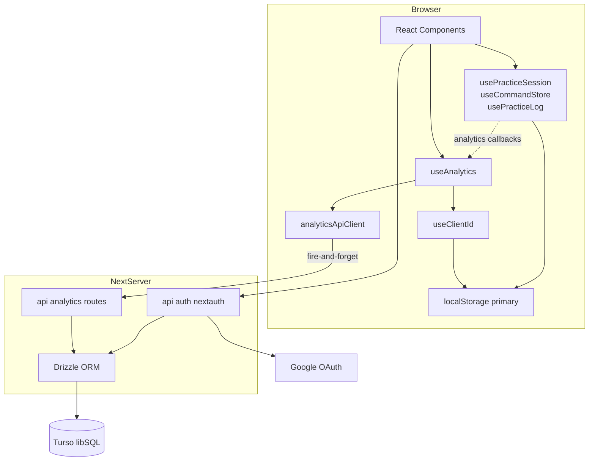
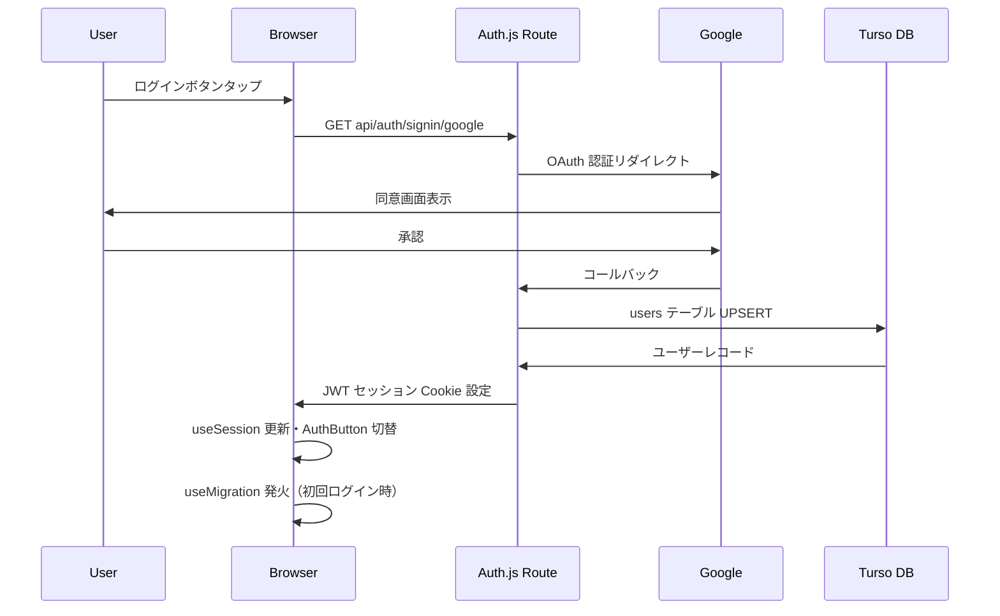
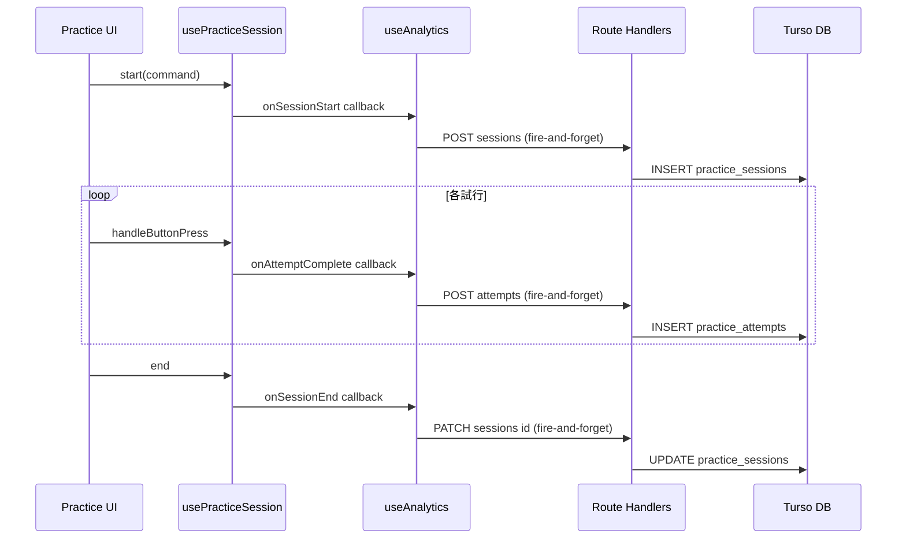
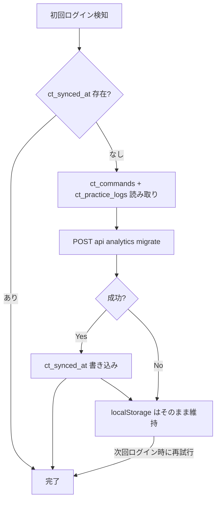
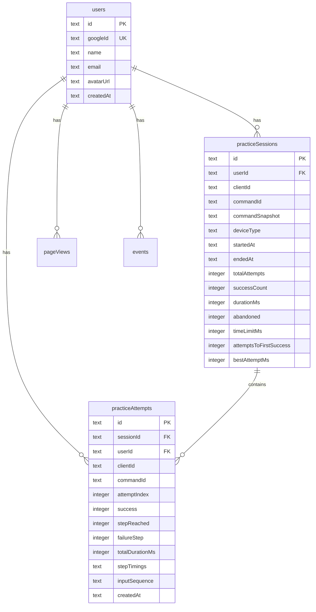

# 技術設計書: data-analytics

## Overview

本フィーチャーは EXVSコマンド道場に Google OAuth 認証と Turso(libSQL) バックエンドを導入し、練習データのサーバー側永続化・ページビュー/行動イベントログ・個人統計API を実現する。

**Purpose**: プレイヤーにデバイスをまたいだ練習履歴の可視化を提供し、運営者にサービスのアクセス・利用状況の把握手段を提供する。  
**Users**: プレイヤー（練習統計・デバイス間データ引き継ぎ）、サービス運営者（アクセス分析・機能改善判断）。  
**Impact**: 既存 localStorage-first アーキテクチャを維持しつつ、Turso DB への副作用書き込みレイヤを並列追加する。

### Goals
- Google OAuth 認証によるデバイスをまたいだデータ永続化
- 練習セッション・試行データの fire-and-forget サーバー記録
- ページビュー・行動イベントによるアクセス分析
- 個人統計 API（成功率・入力速度・失敗ステップ集計）

### Non-Goals
- ランキング公開・ユーザー間比較機能（将来スペック）
- 管理者ダッシュボード UI（将来スペック）
- メール/パスワード認証
- 練習画面・コマンド編集画面の UX 変更

---

## Boundary Commitments

### This Spec Owns
- Google OAuth 認証フロー（Auth.js v5）とセッション管理（1.1–1.5）
- `ct_client_id` UUID の生成・localStorage 保存（2.1）
- 全アナリティクスデータの Turso DB 書き込み Route Handler
- localStorage → DB 初回ログイン時データ移行（7.1–7.3）
- 統計取得 API（`/api/analytics/stats`）（8.1–8.5）
- ヘッダー認証状態表示コンポーネント `AuthButton`（1.6）

### Out of Boundary
- 既存 `usePracticeLog` / `useCommandStore` の localStorage 書き込み（変更なし）
- 練習画面・コマンド編集画面のレイアウト・インタラクション
- ランキング表示・ユーザー間比較

### Allowed Dependencies
- `src/hooks/usePracticeSession` — optional timing callback 追加（4.1–4.5 対応の最小修正）
- `src/app/commands/new/page.tsx` — `command_created` イベント呼び出し追加
- `src/app/commands/page.tsx` — `command_deleted` イベント呼び出し追加
- `src/features/practice/PracticeSession.tsx` — analytics options を `usePracticeSession` に渡す
- `src/components/HamburgerMenu.tsx` — `AuthButton` 組み込み
- `src/app/layout.tsx` — `SessionProvider`・`AnalyticsPageViewTracker` 追加

### Revalidation Triggers
- `PracticeAttempt` / `Command` / `PracticeLog` 型変更 → `analytics/types.ts` との整合性確認
- Route Handler リクエストスキーマ変更 → `apiClient.ts` 再検証
- Auth.js セッション形式変更 → 全 Route Handler の認証検証ロジック再検証

---

## Architecture

### Existing Architecture Analysis

現在のアーキテクチャは localStorage-first SPA。`useCommandStore`・`usePracticeLog`・`usePracticeSession` がデータを管理し、バックエンド API は存在しない。本フィーチャーは既存アーキテクチャを変更せず、**副作用アナリティクスレイヤ**として並列追加する。

### Architecture Pattern & Boundary Map



**選択パターン**: Side-Effect Analytics Overlay。既存 primaryフローを変更せず、副作用として DB に書き込む（詳細な選定理由は `research.md` 参照）。

**依存方向**: `analytics/types.ts` → `lib/db/schema.ts` → `lib/db/client.ts` → Route Handlers → `analytics/apiClient.ts` → `analytics/use*.ts` → UI コンポーネント。上位レイヤは下位レイヤのみをインポートする。

### Technology Stack

| Layer | Choice / Version | Role |
|-------|-----------------|------|
| Auth | next-auth@beta (Auth.js v5) | Google OAuth フロー・JWT セッション管理 |
| ORM | drizzle-orm + drizzle-kit | 型安全 Turso アクセス・スキーマ管理 |
| DB Driver | @libsql/client | Turso libSQL 接続 |
| DB | Turso (libSQL / SQLite 互換) | アナリティクスデータ永続化 |
| Runtime | Next.js 16.2.4 App Router | Route Handlers（Server-side API） |

Drizzle ORM 採用理由: TypeScript ネイティブ型安全、libSQL 公式サポート、`drizzle-kit` でスキーマ管理が完結。ステアリングで計画されていた Firebase は Turso に変更（詳細は `research.md` 参照）。

---

## File Structure Plan

### Directory Structure

```
next/src/
├── lib/
│   ├── auth.ts                           # Auth.js 設定（providers, callbacks）
│   └── db/
│       ├── client.ts                     # Drizzle + Turso クライアントシングルトン
│       └── schema.ts                     # Drizzle テーブル定義（5 テーブル）
├── features/
│   └── analytics/
│       ├── types.ts                      # Analytics 専用型定義（StatsResponse 等）
│       ├── apiClient.ts                  # Fire-and-forget API 呼び出しモジュール
│       ├── useClientId.ts                # ct_client_id 管理フック
│       ├── useAnalytics.ts              # 統合アナリティクスフック
│       ├── useMigration.ts             # localStorage → DB マイグレーションフック
│       └── AnalyticsPageViewTracker.tsx # ルート変化検知・ページビュー送信（null render）
├── components/
│   └── AuthButton.tsx                    # ログイン状態表示コンポーネント
└── app/
    ├── layout.tsx                        # SessionProvider・AnalyticsPageViewTracker 追加
    └── api/
        ├── auth/[...nextauth]/route.ts   # Auth.js ハンドラ
        └── analytics/
            ├── sessions/
            │   ├── route.ts             # POST: セッション作成
            │   └── [id]/route.ts        # PATCH: セッション更新
            ├── attempts/route.ts        # POST: 試行記録
            ├── pageviews/route.ts       # POST: ページビュー記録
            ├── events/route.ts          # POST: イベント記録
            ├── stats/route.ts           # GET: 統計取得
            └── migrate/route.ts         # POST: localStorage マイグレーション
```

### Modified Files

- `src/hooks/usePracticeSession.ts` — `UsePracticeSessionOptions` 追加・タイミング計測 Ref 追加
- `src/features/practice/PracticeSession.tsx` — `usePracticeSession` に analytics options を渡す
- `src/app/commands/new/page.tsx` — `addCommand` 成功時に `trackEvent('command_created')` 追加
- `src/app/commands/page.tsx` — `removeCommand` 成功時に `trackEvent('command_deleted')` 追加
- `src/components/HamburgerMenu.tsx` — `AuthButton` 組み込み
- `src/app/layout.tsx` — `SessionProvider` ラッパーと `AnalyticsPageViewTracker` 追加

---

## System Flows

### Google OAuth 認証フロー



### 練習セッション アナリティクスフロー



**Key Decisions**: `session_id` はクライアント生成 UUID を使用し、POST sessions のレスポンス待ち不要とする（競合回避）。全コールバックは localStorage 書き込みと同タイミングで呼ばれる。

### localStorage マイグレーションフロー



---

## Requirements Traceability

| 要件 | 概要 | コンポーネント | インターフェース | フロー |
|------|------|--------------|----------------|--------|
| 1.1–1.5 | Google OAuth フロー | auth.ts, AuthRoute | Auth.js config | OAuth 認証フロー |
| 1.6 | ヘッダー認証状態表示 | AuthButton | AuthButtonProps | — |
| 2.1 | client_id 生成・保存 | useClientId | UseClientIdReturn | — |
| 2.2, 2.4 | 全記録へ client_id 付与 | apiClient | 全 Request ボディ | — |
| 2.3 | ログイン時 client_id + user_id 付与 | useAnalytics | UseAnalyticsReturn | — |
| 3.1–3.6 | 練習セッション記録 | useAnalytics, sessions route | CreateSessionRequest / UpdateSessionRequest | セッションフロー |
| 4.1–4.5 | 練習試行詳細記録 | usePracticeSession 修正, attempts route | AttemptAnalyticsData / CreateAttemptRequest | セッションフロー |
| 4.6 | fire-and-forget | apiClient | void 戻り値・catch 無視 | — |
| 5.1–5.3 | ページビュー記録 | AnalyticsPageViewTracker, pageviews route | CreatePageViewRequest | — |
| 6.1–6.4 | 行動イベントログ | page コンポーネント修正, events route | AnalyticsEventType / CreateEventRequest | — |
| 7.1–7.4 | localStorage マイグレーション | useMigration, migrate route | MigrateRequest / MigrateResponse | マイグレーションフロー |
| 8.1–8.5 | 統計 API | stats route | StatsResponse | — |

---

## Components and Interfaces

### サマリーテーブル

| Component | Layer | Intent | 要件 | Key Dependencies |
|-----------|-------|--------|------|-----------------|
| auth.ts | Config | Auth.js Google OAuth 設定 | 1.1–1.5 | next-auth, lib/db/client |
| lib/db/schema.ts | Repo | Drizzle スキーマ定義 | 3, 4, 5, 6 | drizzle-orm |
| lib/db/client.ts | Repo | Drizzle + Turso クライアント | 全 DB アクセス | @libsql/client |
| useClientId | Hook | ct_client_id 生成・管理 | 2.1 | localStorage |
| useAnalytics | Hook | 統合アナリティクスフック | 2–6 | apiClient, useClientId, next-auth |
| useMigration | Hook | localStorage マイグレーション | 7.1–7.4 | next-auth, localStorage |
| analyticsApiClient | Module | fire-and-forget API 呼び出し | 4.6, 5.3 | fetch |
| AuthButton | Component | ログイン状態表示 UI | 1.6 | next-auth useSession |
| sessions Route | API | セッション作成・更新 | 3.1–3.6 | lib/db/client, lib/auth |
| attempts Route | API | 試行記録 | 4.1–4.5 | lib/db/client |
| pageviews Route | API | ページビュー記録 | 5.1–5.3 | lib/db/client |
| events Route | API | 行動イベント記録 | 6.1–6.4 | lib/db/client |
| stats Route | API | 統計集計・取得 | 8.1–8.5 | lib/db/client, lib/auth |
| migrate Route | API | localStorage データ移行 | 7.1–7.3 | lib/db/client, lib/auth |

---

### Auth Layer

#### auth.ts

| Field | Detail |
|-------|--------|
| Intent | Auth.js v5 の設定。Google OAuth プロバイダー・JWT セッション・users テーブル UPSERT を構成する |
| Requirements | 1.1, 1.2, 1.3, 1.4, 1.5 |

**Dependencies**
- Outbound: `lib/db/client` — users テーブル UPSERT（P0）
- External: `next-auth@beta`, Google OAuth 2.0（P0）

**Contracts**: Service [x] / State [x]

##### Service Interface

```typescript
// src/lib/auth.ts
import NextAuth from 'next-auth';
import type { Session } from 'next-auth';

export const { handlers, auth, signIn, signOut } = NextAuth({ /* ... */ });

declare module 'next-auth' {
  interface Session {
    user: {
      id: string;       // users.id (UUID)
      name: string;
      email: string;
      image: string | null;
    };
  }
}
```

- Preconditions: 環境変数 `AUTH_SECRET`、`AUTH_GOOGLE_ID`、`AUTH_GOOGLE_SECRET` が設定済み
- Postconditions: `signIn` callback 完了後、`users` テーブルに該当ユーザーのレコードが存在する
- Invariants: `session.user.id` は常に `users.id`（UUID）と一致する

**Implementation Notes**
- Integration: JWT ストラテジー採用。`signIn` callback 内で `users` テーブルを `INSERT OR REPLACE` で UPSERT する（Drizzle Adapter 不使用。理由は `research.md` 参照）
- Validation: Route Handler で `auth()` を呼び、`session?.user?.id` の存在を検証する
- Risks: Auth.js v5 はベータ版 — 実装時に最新リリースノートを確認すること

---

### DB Layer

#### lib/db/schema.ts

| Field | Detail |
|-------|--------|
| Intent | Drizzle ORM のテーブル定義。5 テーブルと Drizzle 型エクスポート |
| Requirements | 3.1–3.6, 4.1–4.5, 5.1–5.2, 6.1–6.4, 7.1, 8.1–8.5 |

**Contracts**: State [x]

##### Physical Data Model

```typescript
// src/lib/db/schema.ts
import { sqliteTable, text, integer } from 'drizzle-orm/sqlite-core';

export const users = sqliteTable('users', {
  id:        text('id').primaryKey(),                   // UUID
  googleId:  text('google_id').notNull().unique(),
  name:      text('name').notNull(),
  email:     text('email').notNull(),
  avatarUrl: text('avatar_url'),
  createdAt: text('created_at').notNull(),              // ISO 8601
});

export const practiceSessions = sqliteTable('practice_sessions', {
  id:                     text('id').primaryKey(),      // クライアント生成 UUID
  userId:                 text('user_id').references(() => users.id),
  clientId:               text('client_id').notNull(),
  commandId:              text('command_id').notNull(),
  commandSnapshot:        text('command_snapshot').notNull(),  // JSON (Command)
  deviceType:             text('device_type').notNull(),       // 'mobile' | 'desktop'
  startedAt:              text('started_at').notNull(),
  endedAt:                text('ended_at'),
  totalAttempts:          integer('total_attempts').notNull().default(0),
  successCount:           integer('success_count').notNull().default(0),
  durationMs:             integer('duration_ms'),
  abandoned:              integer('abandoned').notNull().default(0),  // 0/1
  timeLimitMs:            integer('time_limit_ms'),
  attemptsToFirstSuccess: integer('attempts_to_first_success'),
  bestAttemptMs:          integer('best_attempt_ms'),
});

export const practiceAttempts = sqliteTable('practice_attempts', {
  id:             text('id').primaryKey(),
  sessionId:      text('session_id').notNull().references(() => practiceSessions.id),
  userId:         text('user_id').references(() => users.id),
  clientId:       text('client_id').notNull(),
  commandId:      text('command_id').notNull(),
  attemptIndex:   integer('attempt_index').notNull(),
  success:        integer('success').notNull(),          // 0/1
  stepReached:    integer('step_reached').notNull(),
  failureStep:    integer('failure_step'),
  totalDurationMs: integer('total_duration_ms').notNull(),
  stepTimings:    text('step_timings').notNull(),        // JSON: StepTiming[]
  inputSequence:  text('input_sequence'),                // JSON: ButtonType[] | null
  createdAt:      text('created_at').notNull(),
});

export const pageViews = sqliteTable('page_views', {
  id:        text('id').primaryKey(),
  userId:    text('user_id').references(() => users.id),
  clientId:  text('client_id').notNull(),
  path:      text('path').notNull(),
  referrer:  text('referrer'),
  userAgent: text('user_agent'),
  createdAt: text('created_at').notNull(),
});

export const events = sqliteTable('events', {
  id:        text('id').primaryKey(),
  userId:    text('user_id').references(() => users.id),
  clientId:  text('client_id').notNull(),
  eventType: text('event_type').notNull(),
  payload:   text('payload'),                           // JSON | null
  createdAt: text('created_at').notNull(),
});
```

**Indexes** (drizzle-kit で定義):
- `practice_sessions(client_id)`, `practice_sessions(user_id)`
- `practice_attempts(session_id)`, `practice_attempts(command_id, client_id)`
- `page_views(client_id)`, `events(client_id, event_type)`

**Consistency & Integrity**: `user_id` は全テーブルで NULLABLE — 匿名ユーザーは `client_id` のみで追跡。`practice_sessions.id` はクライアント生成 UUID（競合回避のため）。INSERT 時は `INSERT OR IGNORE` で冪等化する。

---

#### lib/db/client.ts

| Field | Detail |
|-------|--------|
| Intent | Drizzle + Turso クライアントのシングルトン。**サーバーサイド専用**。 |
| Requirements | 全 DB アクセスの前提 |

**Contracts**: Service [x]

##### Service Interface

```typescript
// src/lib/db/client.ts
import { drizzle } from 'drizzle-orm/libsql';
import { createClient } from '@libsql/client';
import * as schema from './schema';

const turso = createClient({
  url: process.env.TURSO_DATABASE_URL!,
  authToken: process.env.TURSO_AUTH_TOKEN,
});

export const db = drizzle(turso, { schema });
export type DB = typeof db;
```

- 環境変数: `TURSO_DATABASE_URL`（必須）、`TURSO_AUTH_TOKEN`（本番必須）
- クライアントコンポーネントからのインポート禁止（サーバーサイド専用）

---

### Analytics Feature Layer

#### useClientId

| Field | Detail |
|-------|--------|
| Intent | `ct_client_id` UUID の生成・localStorage 保持 |
| Requirements | 2.1 |

**Contracts**: Service [x] / State [x]

##### Service Interface

```typescript
// src/features/analytics/useClientId.ts
export interface UseClientIdReturn {
  clientId: string;  // 常に非空 UUID（SSR 中は空文字列）
}

export function useClientId(): UseClientIdReturn;
```

- Invariants: `clientId` は `useEffect` 実行後に必ず非空 UUID を持つ
- localStorage key: `ct_client_id`

---

#### useAnalytics

| Field | Detail |
|-------|--------|
| Intent | 認証状態・client_id を統合し、アナリティクス API を fire-and-forget で呼び出す統合フック |
| Requirements | 2.2, 2.3, 2.4, 3.1–3.6, 5.1, 6.1–6.4 |

**Dependencies**
- Inbound: `PracticeSession` — analytics options を通じて呼び出し（P0）
- Outbound: `analyticsApiClient` — API 呼び出し（P0）、`useClientId` — client_id 取得（P0）
- External: `next-auth/react` の `useSession()` — userId 取得（P1）

**Contracts**: Service [x]

##### Service Interface

```typescript
// src/features/analytics/useAnalytics.ts
import type { ButtonType } from '@/types';

export type AnalyticsEventType =
  | 'command_created'
  | 'command_deleted'
  | 'free_play_used';

export interface TrackSessionStartParams {
  sessionId: string;            // クライアント生成 UUID
  commandId: string;
  commandSnapshot: string;      // JSON.stringify(Command)
  deviceType: 'mobile' | 'desktop';
  timeLimitMs?: number;
}

export interface AttemptAnalyticsData {
  sessionId: string;
  commandId: string;
  attemptIndex: number;
  success: boolean;
  stepReached: number;
  failureStep: number | null;
  totalDurationMs: number;
  stepTimings: Array<{ step: number; duration_ms: number }>;
  inputSequence: ButtonType[] | null;
}

export interface TrackSessionEndParams {
  endedAt: string;
  totalAttempts: number;
  successCount: number;
  durationMs: number;
  abandoned: boolean;
  attemptsToFirstSuccess: number | null;
  bestAttemptMs: number | null;
}

export interface UseAnalyticsReturn {
  trackSessionStart(params: TrackSessionStartParams): void;
  trackAttempt(data: AttemptAnalyticsData): void;
  trackSessionEnd(sessionId: string, params: TrackSessionEndParams): void;
  trackPageView(path: string): void;
  trackEvent(type: AnalyticsEventType, payload?: Record<string, unknown>): void;
}

export function useAnalytics(): UseAnalyticsReturn;
```

- 全メソッドは fire-and-forget: 戻り値なし、例外を投げない
- `clientId` は `useClientId()` から取得（常に非空）
- `userId` は `useSession()` から取得（未ログイン時は `null`）

---

#### useMigration

| Field | Detail |
|-------|--------|
| Intent | 初回ログイン時に localStorage データを Turso DB へ同期する |
| Requirements | 7.1, 7.2, 7.3 |

**Contracts**: Service [x] / State [x]

##### Service Interface

```typescript
// src/features/analytics/useMigration.ts
export type MigrationStatus = 'idle' | 'pending' | 'done' | 'error';

export interface UseMigrationReturn {
  status: MigrationStatus;
}

export function useMigration(): UseMigrationReturn;
```

- 発火条件: `useSession()` が認証済みを返し、`ct_synced_at` が localStorage に存在しない
- Postconditions（成功時）: `ct_synced_at` を localStorage に書き込む（7.2）
- Postconditions（失敗時）: `ct_synced_at` は書き込まない、localStorage データは保持（7.3）
- 7.4: localStorage は既存フックがプライマリとして維持（変更なし）

---

#### analyticsApiClient

| Field | Detail |
|-------|--------|
| Intent | アナリティクス API への fire-and-forget fetch 呼び出しを集約するモジュール（フックではない） |
| Requirements | 4.6, 5.3 |

**Contracts**: Service [x]

##### Service Interface

```typescript
// src/features/analytics/apiClient.ts
import type { ButtonType, Command, PracticeLog } from '@/types';

// --- Request 型 ---
export interface CreateSessionRequest {
  sessionId: string;
  clientId: string;
  userId: string | null;
  commandId: string;
  commandSnapshot: string;
  deviceType: 'mobile' | 'desktop';
  startedAt: string;
  timeLimitMs?: number;
}

export interface UpdateSessionRequest {
  endedAt: string;
  totalAttempts: number;
  successCount: number;
  durationMs: number;
  abandoned: boolean;
  attemptsToFirstSuccess: number | null;
  bestAttemptMs: number | null;
}

export interface CreateAttemptRequest {
  sessionId: string;
  clientId: string;
  userId: string | null;
  commandId: string;
  attemptIndex: number;
  success: boolean;
  stepReached: number;
  failureStep: number | null;
  totalDurationMs: number;
  stepTimings: Array<{ step: number; duration_ms: number }>;
  inputSequence: ButtonType[] | null;
}

export interface CreatePageViewRequest {
  clientId: string;
  userId: string | null;
  path: string;
  referrer: string | null;
  userAgent: string | null;
}

export interface CreateEventRequest {
  clientId: string;
  userId: string | null;
  eventType: string;
  payload: Record<string, unknown> | null;
}

export interface MigrateRequest {
  commands: Command[];
  practiceLogs: Record<string, PracticeLog>;
}

export interface MigrateResponse {
  migratedCommands: number;
  migratedLogs: number;
}

// --- 関数シグネチャ ---
export function postSession(body: CreateSessionRequest): void;
export function patchSession(sessionId: string, body: UpdateSessionRequest): void;
export function postAttempt(body: CreateAttemptRequest): void;
export function postPageView(body: CreatePageViewRequest): void;
export function postEvent(body: CreateEventRequest): void;
export function postMigrate(body: MigrateRequest): Promise<MigrateResponse | null>;
export function getStats(clientId: string | null): Promise<import('./types').StatsResponse | null>;
```

- `void` 返却の全関数は `void fetch(...).catch(() => {})` パターン — エラーをサイレントに処理
- `getStats` / `postMigrate` はエラー時 `null` を返す（呼び出し元が null チェック）

---

#### AuthButton

| Field | Detail |
|-------|--------|
| Intent | ヘッダーのログイン状態表示。認証済み → アバター + 表示名、未認証 → ログインボタン |
| Requirements | 1.6 |

**Contracts**: State [x]

```typescript
// src/components/AuthButton.tsx
export interface AuthButtonProps {
  className?: string;
}

export function AuthButton(props: AuthButtonProps): JSX.Element;
```

- `'use client'` 指定が必要（`useSession()` を使用）
- ログインボタン → `signIn('google')` 呼び出し（1.1）
- ログアウト → `signOut()` 呼び出し（1.4）
- セッション復元は Auth.js が JWT Cookie で自動処理（1.3）
- エラー表示（1.5）は Auth.js の `error` セッション状態で制御

---

### usePracticeSession 修正インターフェース（既存フック拡張）

4.1–4.5 の試行タイミングデータ収集のため、optional callback パラメータを追加する。

```typescript
// src/hooks/usePracticeSession.ts 追加分
export interface AttemptAnalyticsData {
  sessionId: string;
  commandId: string;
  attemptIndex: number;
  success: boolean;
  stepReached: number;
  failureStep: number | null;
  totalDurationMs: number;
  stepTimings: Array<{ step: number; duration_ms: number }>;
  inputSequence: ButtonType[] | null;
}

export interface UsePracticeSessionOptions {
  sessionId?: string;
  onSessionStart?: (commandSnapshot: string) => void;
  onAttemptComplete?: (data: AttemptAnalyticsData) => void;
  onSessionEnd?: (stats: {
    totalAttempts: number;
    successCount: number;
    durationMs: number;
    abandoned: boolean;
    attemptsToFirstSuccess: number | null;
    bestAttemptMs: number | null;
  }) => void;
}

// 変更後シグネチャ
export function usePracticeSession(
  options?: UsePracticeSessionOptions,
): UsePracticeSessionReturn;  // 戻り値型は変更なし
```

- Preconditions: `options` が未指定の場合は既存動作と完全互換（既存テスト無変更）
- タイミング計測は `useRef` で管理（再レンダリング不要）
- `onAttemptComplete` は既存の `recordAttempt`（localStorage）と同タイミングで呼ばれる

---

### API コントラクト一覧

| Method | Endpoint | Request | Response | Errors |
|--------|----------|---------|----------|--------|
| POST | /api/auth/[...nextauth] | OAuth redirect | Cookie set | 400, 500 |
| POST | /api/analytics/sessions | CreateSessionRequest | `{ sessionId: string }` | 400, 500 |
| PATCH | /api/analytics/sessions/[id] | UpdateSessionRequest | `{ ok: true }` | 400, 404, 500 |
| POST | /api/analytics/attempts | CreateAttemptRequest | `{ ok: true }` | 400, 500 |
| POST | /api/analytics/pageviews | CreatePageViewRequest | `{ ok: true }` | 400, 500 |
| POST | /api/analytics/events | CreateEventRequest | `{ ok: true }` | 400, 500 |
| GET | /api/analytics/stats | query: `?clientId=` または認証 Cookie | StatsResponse | 400, 500 |
| POST | /api/analytics/migrate | MigrateRequest | MigrateResponse | 401, 500 |

---

## Data Models

### Domain Model



**Invariants**:
- `user_id` は全テーブルで NULLABLE — 匿名ユーザーは `client_id` のみで識別
- `commandSnapshot` は JSON 文字列（`Command` 型をシリアライズ）。コマンド変更後もセッション記録が追跡可能（3.3）
- `stepTimings` / `inputSequence` / `payload` は JSON 文字列。Drizzle レイヤで parse/stringify する

### Stats Response (Supporting Reference)

```typescript
// src/features/analytics/types.ts
export interface StatsResponse {
  commandStats: CommandStat[];
  dailyPractice: DailyPractice[];
}

export interface CommandStat {
  commandId: string;
  commandName: string;
  totalAttempts: number;
  successCount: number;
  successRate: number;                    // 0.0–1.0
  avgDurationMs: number;
  stepFailureRates: StepFailureRate[];    // 8.2: ステップ別失敗率
}

export interface StepFailureRate {
  step: number;
  failureCount: number;
  failureRate: number;                    // 0.0–1.0
}

export interface DailyPractice {
  date: string;                           // YYYY-MM-DD (8.4: 日次集計)
  attemptCount: number;
}
```

---

## Error Handling

### Error Strategy

| カテゴリ | 発生源 | 挙動 |
|---------|--------|------|
| Analytics API 失敗（4xx/5xx/Network） | apiClient | `catch(() => {})` でサイレント無視（4.6, 5.3） |
| OAuth 失敗 | Auth.js | エラーメッセージ表示、ログイン前状態維持（1.5） |
| localStorage 移行失敗 | useMigration | `ct_synced_at` 書き込まない、localStorage 保持（7.3） |
| DB 書き込み失敗 | Route Handler | 500 を返す。クライアント側は catch でサイレント無視 |
| stats API 失敗 | getStats() | `null` を返す。UI は「データなし」として扱う（8.5） |
| 統計データ未存在 | stats Route | 空の `StatsResponse` を返す（8.5）。エラーにしない |

### Monitoring

- Route Handler の 5xx エラーは Next.js デフォルトサーバーログに記録
- Turso ダッシュボードでクエリエラー率を監視

---

## Testing Strategy

### Unit Tests

- `useClientId`: 初回アクセスで UUID 生成・2 回目以降は同一値・SSR 中は空文字列
- `useMigration`: `ct_synced_at` なし + 認証済みで migrate API 呼び出し発生、成功時フラグ書き込み、失敗時フラグ不書き込み
- `analyticsApiClient`: fetch 失敗時に例外をスローしないこと

### Integration Tests

- OAuth ログイン → `users` テーブル UPSERT（新規作成・重複時の更新）
- POST /sessions → PATCH /sessions/id の一連フロー
- 未認証ユーザーの GET /stats → `client_id` パラメータでデータ返却

### E2E Tests

- ログインボタン → Google OAuth → ヘッダーにアバター表示（1.6）
- 練習セッション完了 → `practice_sessions` と `practice_attempts` レコード存在確認
- 初回ログイン → localStorage データが DB にマイグレーション

---

## Security Considerations

- **CSRF**: Auth.js v5 が CSRF 保護を内蔵（JWT + `sameSite: lax` Cookie）
- **認証チェック**: `/api/analytics/migrate` と認証ユーザー向け `/api/analytics/stats` は `auth()` でセッション検証し、未認証時 401 を返す
- **入力検証**: Route Handler は全リクエストボディをインラインチェックで検証。SQL インジェクションは Drizzle ORM のパラメータバインディングで防止
- **環境変数**: `TURSO_DATABASE_URL`、`TURSO_AUTH_TOKEN`、`AUTH_SECRET`、`AUTH_GOOGLE_ID`、`AUTH_GOOGLE_SECRET` は `.env.local` および Vercel 環境変数で管理。コードへのハードコード禁止

## Migration Strategy

7.1–7.4 の localStorage → DB マイグレーションは `useMigration` フックが担当（詳細は System Flows 参照）。`/api/analytics/migrate` Route Handler は `INSERT OR IGNORE` で冪等性を保証する。
