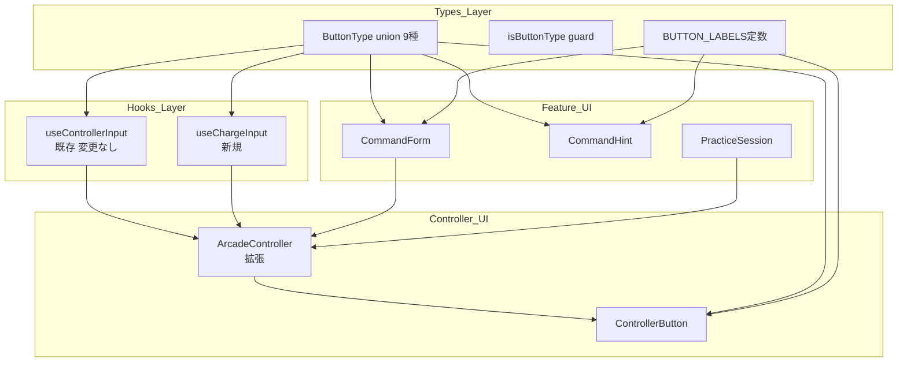
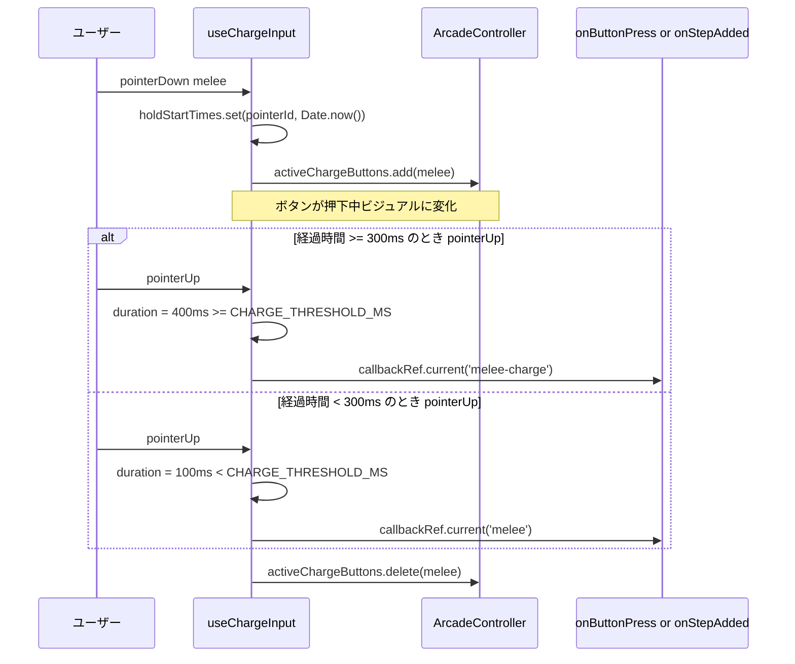

# Technical Design: extended-input-types

---

## Overview

本機能は コマンドトレーナー の入力タイプを現在の4種（shot, melee, jump, awaken）から9種へ拡張し、格闘チャージ・射撃チャージ・サブ・特射・特格を追加する。

**Purpose**: チャージ技と複合技を含むエクバコマンドをプレイヤーが登録・練習できるようにし、実機に近い練習体験を提供する。
**Users**: コマンド登録ユーザー（CommandForm）と練習セッションユーザー（PracticeSession）の両方が対象。
**Impact**: `ButtonType` union を5種拡張し、新規フック `useChargeInput` を追加、`ArcadeController` を8ボタン対応に拡張する。既存コマンドデータおよびテストの互換性は完全に保たれる。

### Goals

- `ButtonType` に `'melee-charge' | 'shot-charge' | 'sub' | 'special-shot' | 'special-melee'` を追加（完全な型安全）
- 保持時間に基づくチャージ検出（300ms しきい値）を `useChargeInput` フックとして実装
- `ArcadeController` UI に8種の入力ボタンを表示
- 既存の `useControllerInput`・`usePracticeSession` のコードおよびテストをゼロ変更で保つ

### Non-Goals

- チャージしきい値のユーザー設定UI
- `awaken` ボタンのUI表示（型は保持）
- 物理同時押し検出によるサブ/特射/特格判定
- Firebase・ランキング連携

---

## Boundary Commitments

### This Spec Owns

- `ButtonType` 型定義の拡張と `isButtonType` 型ガード
- `useChargeInput` フックのインターフェースと動作契約
- `ArcadeController` の8ボタン対応と2フック統合
- 全コンポーネントの `BUTTON_LABELS` 更新
- 上記に対するユニット・統合テスト

### Out of Boundary

- `usePracticeSession` の判定ロジック（変更なし）
- `useControllerInput` のコード（変更なし）
- CSS/スタイリングの最終デザイン（実装フェーズで決定）
- ローカルストレージの既存データマイグレーション（後方互換性あり）

### Allowed Dependencies

- `src/types/index.ts`（`ButtonType`、`CommandStep`）
- `src/hooks/useControllerInput.ts`（`PointerHandlers` 型の流用）
- `React`（useState, useRef, useCallback）

### Revalidation Triggers

- `ButtonType` union の変更は全 `Record<ButtonType, string>` 使用箇所の再確認が必要
- `useChargeInput` の公開インターフェース変更は `ArcadeController` の修正を要する
- `ArcadeControllerProps` の変更は `CommandForm`・`PracticeSession` の再確認を要する

---

## Architecture

### Existing Architecture Analysis

| 層 | 現状 | 本機能の変更 |
|----|------|------------|
| 型 | `ButtonType` 4種 | 9種に拡張 + 型ガード追加 |
| フック（入力） | `useControllerInput`（pointerDown 即時発火） | 変更なし。新規 `useChargeInput` を並置 |
| フック（練習） | `usePracticeSession`（`handleButtonPress(button)` で評価） | 変更なし |
| UI（コントローラ） | `ArcadeController`（3ボタン固定） | 8ボタン対応、`useChargeInput` 統合 |
| UI（編集・ヒント） | `CommandForm`, `CommandHint`（ラベル辞書あり） | ラベル追加のみ |

### Architecture Pattern & Boundary Map



**アーキテクチャ統合**:
- 選択パターン: **フック分離型拡張**。`useControllerInput`（即時発火）と `useChargeInput`（pointerUp 発火）を独立させ `ArcadeController` で統合する。
- 依存方向: `Types → Hooks → UI`（上位層への依存禁止）
- 既存パターン保持: `pointerMapRef` によるポインターID追跡、`callbackRef` によるクロージャ回避パターンを `useChargeInput` でも踏襲
- 新規コンポーネント: `useChargeInput` のみ。UI コンポーネントは既存の拡張

### Technology Stack

| Layer | Choice / Version | Role in Feature | Notes |
|-------|------------------|-----------------|-------|
| 型システム | TypeScript strict | `ButtonType` union, 型ガード | 既存 strict モード踏襲 |
| フロントエンド | React 18 + Next.js App Router | `useRef`, `useState`, `useCallback` | 既存スタック |
| テスト | Vitest + @testing-library/react | `vi.setSystemTime()` でチャージしきい値テスト | fake timers 不要、setSystemTime で十分 |

---

## File Structure Plan

### Directory Structure

```
next/src/
├── types/
│   └── index.ts                    # ButtonType 拡張 + isButtonType 追加
├── hooks/
│   ├── useControllerInput.ts       # 変更なし
│   └── useChargeInput.ts           # 新規: チャージ検出フック
├── features/
│   ├── arcade-controller/
│   │   ├── ArcadeController.tsx    # BUTTONS 拡張 + useChargeInput 統合
│   │   └── ControllerButton.tsx    # BUTTON_LABELS 拡張
│   ├── command-editor/
│   │   └── CommandForm.tsx         # BUTTON_LABELS 型強化 + ラベル追加
│   └── practice/
│       └── CommandHint.tsx         # BUTTON_LABELS 拡張
└── __tests__/
    ├── hooks/
    │   └── useChargeInput.test.ts  # 新規テスト
    └── features/
        └── arcade-controller/
            └── ArcadeController.test.tsx  # チャージ・複合ボタンテスト追加
```

### Modified Files

- `src/types/index.ts` — `ButtonType` union に5種追加、`isButtonType` 型ガードを新規公開
- `src/hooks/useChargeInput.ts` — **新規作成**。チャージ検出ロジック
- `src/features/arcade-controller/ArcadeController.tsx` — `BUTTONS` 定数を拡張、`useChargeInput` を組み込み
- `src/features/arcade-controller/ControllerButton.tsx` — `BUTTON_LABELS` に5種ラベル追加
- `src/features/command-editor/CommandForm.tsx` — `BUTTON_LABELS` の型を `Record<string, string>` から `Record<ButtonType, string>` に変更＋ラベル追加
- `src/features/practice/CommandHint.tsx` — `BUTTON_LABELS` に5種ラベル追加

---

## System Flows

### チャージ入力フロー（pointerUp 発火型）



### 複合ボタン入力フロー（専用ボタン、即時発火）

複合ボタン（`sub`, `special-shot`, `special-melee`）は `useControllerInput.getButtonHandlers(button)` を通じて通常ボタンと同一の即時発火フローをたどる。既存フローのため図を省略。

---

## Requirements Traceability

| Requirement | Summary | Components | Interfaces | Flows |
|-------------|---------|------------|------------|-------|
| 1.1 | ButtonType に5種追加 | `types/index.ts` | `ButtonType` | — |
| 1.2 | CommandStep.buttons に格納可能 | `types/index.ts` | `CommandStep` | — |
| 1.3 | ストレージ読み込み時のバリデーション | `types/index.ts`, `useCommandStore` | `isButtonType` | — |
| 2.1 | melee 保持 → melee-charge 発火 | `useChargeInput` | `getChargeHandlers` | チャージフロー |
| 2.2 | shot 保持 → shot-charge 発火 | `useChargeInput` | `getChargeHandlers` | チャージフロー |
| 2.3 | タップ時はチャージ発火しない | `useChargeInput` | `getChargeHandlers` | チャージフロー |
| 2.4 | 保持時間しきい値で区別 | `useChargeInput` | `CHARGE_THRESHOLD_MS` | チャージフロー |
| 2.5 | 固定しきい値（設定UI不要） | `useChargeInput` | `CHARGE_THRESHOLD_MS = 300` | — |
| 3.1 | sub/special-shot/special-melee の入力手段 | `ArcadeController` | `BUTTONS` 配列拡張 | 複合フロー |
| 3.2–3.4 | 各複合型を単一 CommandStep として発火 | `ArcadeController` | `onStepAdded({ buttons: [type] })` | 複合フロー |
| 3.5 | 個別ボタンを別々に押さなくてよい | `ArcadeController` | 専用ボタン実装 | — |
| 4.1 | 編集フォームに全8種表示 | `ArcadeController`, `CommandForm` | `BUTTONS` 拡張 | — |
| 4.2 | 新型ステップの追加 | `CommandForm` | `onStepAdded` | — |
| 4.3 | 日本語ラベル表示 | `CommandForm`, `ControllerButton` | `BUTTON_LABELS` | — |
| 4.4 | ストレージへの正常保存 | `useCommandStore` | `addCommand` | — |
| 5.1 | 新8種のUI表示 | `ArcadeController`, `ControllerButton` | `BUTTONS` 配列 | — |
| 5.2 | 新型入力のイベント発火 | `ArcadeController` | `onButtonPress` / `onStepAdded` | — |
| 5.3 | チャージ保持中のビジュアル | `useChargeInput`, `ControllerButton` | `activeChargeButtons` | — |
| 5.4 | onStepAdded モードでの動作 | `ArcadeController` | `onStepAdded` | — |
| 5.5 | 練習モードでのハイライト | `ArcadeController`, `ControllerButton` | `highlightedButton` | — |
| 6.1–6.2 | 練習時の新型判定 | `usePracticeSession`（変更なし） | `handleButtonPress` | — |
| 6.3 | タップ vs チャージの失敗判定 | `useChargeInput` + `usePracticeSession` | `CHARGE_THRESHOLD_MS` | チャージフロー |
| 6.4–6.5 | 練習ヒントの新型表示 | `CommandHint` | `BUTTON_LABELS` | — |

---

## Components and Interfaces

### コンポーネントサマリー

| Component | Layer | Intent | Req Coverage | Key Dependencies | Contracts |
|-----------|-------|--------|--------------|------------------|-----------|
| `ButtonType` + `isButtonType` | Types | 9種 union + 実行時ガード | 1.1–1.3 | — | State |
| `useChargeInput` | Hook | 保持時間に基づくチャージ検出 | 2.1–2.5, 5.3, 6.3 | `ButtonType`, `PointerHandlers` | Service |
| `ArcadeController` | UI | 8ボタン統合コントローラ | 3.1–3.5, 4.1–4.4, 5.1–5.5 | `useControllerInput`, `useChargeInput` | State |
| `ControllerButton` | UI | 個別ボタン + ラベル表示 | 4.3, 5.1, 5.3 | `ButtonType`, `BUTTON_LABELS` | — |
| `CommandForm` | UI | ラベル型強化 | 4.1–4.4 | `ArcadeController` | — |
| `CommandHint` | UI | ヒントラベル拡張 | 6.4–6.5 | `ButtonType`, `BUTTON_LABELS` | — |

---

### Types Layer

#### `ButtonType` 拡張 + `isButtonType` 型ガード

| Field | Detail |
|-------|--------|
| Intent | 入力タイプの網羅的な定義と実行時安全性の保証 |
| Requirements | 1.1, 1.2, 1.3 |

**Contracts**: State [x]

##### State Management

```typescript
// src/types/index.ts

export type ButtonType =
  | 'shot' | 'melee' | 'jump' | 'awaken'          // 既存
  | 'shot-charge' | 'melee-charge'                  // チャージ型
  | 'sub' | 'special-shot' | 'special-melee';       // 複合型

const VALID_BUTTON_TYPES = new Set<string>([
  'shot', 'melee', 'jump', 'awaken',
  'shot-charge', 'melee-charge',
  'sub', 'special-shot', 'special-melee',
] as const);

export function isButtonType(value: unknown): value is ButtonType {
  return typeof value === 'string' && VALID_BUTTON_TYPES.has(value);
}

// CommandStep、Command 等の既存型定義は変更なし
```

- Preconditions: `value` は任意の `unknown`
- Postconditions: 戻り値 `true` のとき `value` は `ButtonType` として安全に使用可能
- Invariants: `VALID_BUTTON_TYPES` は `ButtonType` と完全一致を保つ（型が追加されたら同時に更新）

**Implementation Notes**
- `CommandForm.tsx` の `BUTTON_LABELS` 型を `Record<string, string>` → `Record<ButtonType, string>` に変更すると、`ButtonType` 追加時のコンパイルエラーで追加漏れが強制検出される
- `isButtonType` は将来の `useCommandStore.addCommand` でのバリデーションに使用可能

---

### Hooks Layer

#### `useChargeInput`（新規）

| Field | Detail |
|-------|--------|
| Intent | melee/shot ボタンの保持時間を計測し、tap か charge かを判定してコールバックに渡す |
| Requirements | 2.1, 2.2, 2.3, 2.4, 2.5, 5.3, 6.3 |

**Responsibilities & Constraints**
- `melee`, `shot` のみを担当（`jump`, `sub`, `special-shot`, `special-melee` は `useControllerInput` が担当）
- `pointerDown` でホールド開始時刻を記録し、`pointerUp`/`pointerCancel` で判定して発火
- `pointerCancel` はタップ扱い（チャージとしない）— スクロール等による意図しないキャンセルへの配慮
- 視覚フィードバック用に `activeChargeButtons` を公開

**Dependencies**
- Inbound: `ArcadeController` — ボタンハンドラーと `activeChargeButtons` を取得（P0）
- Outbound: `callbackRef` で `ButtonType` コールバックを発火

**Contracts**: Service [x] / State [x]

##### Service Interface

```typescript
// src/hooks/useChargeInput.ts

import type { ButtonType } from '@/types';
import type { PointerHandlers } from '@/hooks/useControllerInput';

export const CHARGE_THRESHOLD_MS = 300;

export type ChargeableButton = 'melee' | 'shot';

const CHARGE_TYPE_MAP: Record<ChargeableButton, { tap: ButtonType; charge: ButtonType }> = {
  melee: { tap: 'melee', charge: 'melee-charge' },
  shot:  { tap: 'shot',  charge: 'shot-charge'  },
};

export interface UseChargeInputReturn {
  /** 現在押下中のチャージ対象ボタンセット（ControllerButton の aria-pressed / isActive に使用）*/
  activeChargeButtons: ReadonlySet<ChargeableButton>;
  /** melee または shot に対応する PointerHandlers を返す */
  getChargeHandlers(button: ChargeableButton): PointerHandlers;
  /** ArcadeController から共通コールバックを登録する */
  setOnInput(callback: ((button: ButtonType) => void) | null): void;
}

export function useChargeInput(): UseChargeInputReturn;
```

**内部動作仕様**:

| イベント | 動作 |
|---------|------|
| `pointerDown(event)` | `holdStartTimes.set(event.pointerId, Date.now())`, `activeChargeButtons.add(button)` |
| `pointerUp(event)` | `duration = Date.now() - holdStartTimes.get(event.pointerId)`, `duration >= CHARGE_THRESHOLD_MS` なら charge 型、そうでなければ tap 型で `callbackRef.current` を呼び出し。`holdStartTimes.delete`, `activeChargeButtons.delete` |
| `pointerCancel(event)` | `holdStartTimes.delete`, `activeChargeButtons.delete`（コールバックは呼ばない） |

- Preconditions: `setOnInput` でコールバックが登録されていること
- Postconditions: コールバックは `tap` か `charge` のいずれか1回だけ呼ばれる
- Invariants: 同一 `pointerId` に対して `pointerDown` なしで `pointerUp` が来ても何もしない

**Implementation Notes**
- `callbackRef`（useRef）でコールバックを保持し、`getChargeHandlers` クロージャ内から最新値を参照（`useControllerInput` と同じパターン）
- `pointerMapRef`（`Map<number, ChargeableButton>`）で `pointerId → button` の対応を管理
- `holdStartTimes`（`Map<number, number>`）で `pointerId → timestamp` を管理
- テスト: `vi.setSystemTime(Date.now() + 350)` で 300ms 超過をシミュレートする

---

### Controller UI Layer

#### `ArcadeController`（拡張）

| Field | Detail |
|-------|--------|
| Intent | 8種の入力ボタンを持つ統合アーケードコントローラUI |
| Requirements | 3.1–3.5, 4.1–4.2, 5.1–5.5 |

**Responsibilities & Constraints**
- `useControllerInput` を `jump`, `sub`, `special-shot`, `special-melee` 用に使用（即時発火）
- `useChargeInput` を `melee`, `shot` 用に使用（pointerUp 発火）
- 両フックのコールバックを `onButtonPress` / `onStepAdded` に統一的に渡す
- 既存の `ArcadeControllerProps` インターフェースに変更なし

**Contracts**: State [x]

##### State Management

```typescript
// 変更なし — 既存インターフェースを維持
export interface ArcadeControllerProps {
  onButtonPress?: (button: ButtonType) => void;
  onStepAdded?: (step: CommandStep) => void;
  highlightedButton?: ButtonType | null;
}
```

**ボタン分類と担当フック**:

| ボタン | ButtonType | 担当フック | 発火タイミング |
|-------|-----------|-----------|--------------|
| 射撃 | `shot` | `useChargeInput` | pointerUp（tap/charge判定） |
| 格闘 | `melee` | `useChargeInput` | pointerUp（tap/charge判定） |
| ジャンプ | `jump` | `useControllerInput` | pointerDown 即時 |
| 射撃チャージ | `shot-charge` | ※自動発火（useChargeInput 経由） | — |
| 格闘チャージ | `melee-charge` | ※自動発火（useChargeInput 経由） | — |
| サブ | `sub` | `useControllerInput` | pointerDown 即時 |
| 特射 | `special-shot` | `useControllerInput` | pointerDown 即時 |
| 特格 | `special-melee` | `useControllerInput` | pointerDown 即時 |

※ `shot-charge` / `melee-charge` は独立ボタンとして表示しない。`useChargeInput` が `shot`/`melee` ボタン長押しを内部で変換して発火する。

**`isActive` の計算**:
- `shot`, `melee` ボタン: `activeChargeButtons.has(button)` を使用
- その他: `activeButtons.has(button)` を使用

**`onButtonPress` / `onStepAdded` の統一処理（useEffect）**:
- `useControllerInput.setOnButtonPress(sharedCallback)` でインスタント系ボタンのコールバックを登録
- `useChargeInput.setOnInput(sharedCallback)` でチャージ系ボタンのコールバックを登録
- `sharedCallback` は `onButtonPress` または `(button) => onStepAdded({ buttons: [button] })` の共通ロジック

**Implementation Notes**
- `shot-charge` / `melee-charge` は UI ボタンとして独立表示しない（`useChargeInput` が自動生成）
- `BUTTONS_INSTANT: ButtonType[]` と `BUTTONS_CHARGE: ChargeableButton[]` を別定数で管理するか、単に `useChargeInput` の担当ボタンを内部で固定するか、実装判断に委ねる
- `highlightedButton` は既存のまま変更不要（新型 ButtonType も `button === highlightedButton` で正しく動作）

---

#### `ControllerButton`（ラベル拡張のみ）

Summary-only: 新型 `ButtonType` に対応する日本語ラベルを `BUTTON_LABELS` に追加するのみ。TypeScript が `Record<ButtonType, string>` の完全性チェックを保証するためコンパイルエラーで漏れを検出できる。

追加ラベル（確定）:

| ButtonType | 日本語ラベル |
|-----------|------------|
| `melee-charge` | 格闘チャージ |
| `shot-charge` | 射撃チャージ |
| `sub` | サブ |
| `special-shot` | 特射 |
| `special-melee` | 特格 |

---

### Feature UI Layer

#### `CommandForm`（型強化 + ラベル追加）

Summary-only: `BUTTON_LABELS` の型を `Record<string, string>` → `Record<ButtonType, string>` に変更し、5種のラベルを追加する。型変更によりラベル漏れをコンパイル時に検出可能になる。

#### `CommandHint`（ラベル追加のみ）

Summary-only: `BUTTON_LABELS: Record<ButtonType, string>` は既に強い型付け済み。新型ラベルを追加するのみで TypeScript が完全性を保証する。

---

## Data Models

### Domain Model

`ButtonType` は値オブジェクト。`CommandStep.buttons: ButtonType[]` が入力タイプを保持するコンテナ。

```typescript
// 既存 CommandStep に変更なし
export type CommandStep = {
  buttons: ButtonType[];  // 例: ['melee-charge'], ['sub']
};
```

**設計方針**: 複合型（`sub` 等）は `['sub']` として保存し、物理多ボタン表現（`['shot', 'melee']`）との意味的分離を維持する。両者は並存可能だが、新規登録では専用型を使用する。

### Logical Data Model

追加なし。`ButtonType` union の拡張は既存 `CommandStep` / `Command` モデルに収まる。ローカルストレージのキーやスキーマ変更はない。

### Data Contracts & Integration

`isButtonType` 型ガードが実行時のバリデーション境界として機能する。`useCommandStore.addCommand` での書き込み前チェックに適用することで、不正な `ButtonType` 文字列がストレージに混入することを防ぐ。

---

## Error Handling

### Error Strategy

チャージ入力に特有のエラーシナリオは限定的。既存の `StorageError` 型を流用する。

### Error Categories and Responses

| カテゴリ | シナリオ | 対応 |
|--------|--------|------|
| ユーザー入力 | 未知の ButtonType が CommandStep に混入 | `isButtonType` で検出 → `parse_error` として `StorageResult` に返却 |
| 入力操作 | チャージ中に `pointerCancel` 発生 | コールバックを呼ばずに状態をクリア（意図しないキャンセルを無視） |
| 練習判定 | チャージ要求ステップでタップ入力 | `usePracticeSession` が通常の失敗として処理（変更なし）|

---

## Testing Strategy

### Unit Tests — `useChargeInput`

1. `pointerDown` → `pointerUp`（100ms）: `'melee'`（tap）コールバックが呼ばれる
2. `pointerDown` → `pointerUp`（400ms）: `'melee-charge'`（charge）コールバックが呼ばれる
3. `pointerDown` → `pointerUp`（CHARGE_THRESHOLD_MS）境界: `'melee'`（等値はタップ扱い）
4. `pointerDown` → `pointerCancel`: コールバック呼ばれない、`activeChargeButtons` から削除される
5. `setOnInput(null)`: `pointerDown`/`pointerUp` 後もコールバック呼ばれない
6. 2本指同時: 2ポインターが独立して tap/charge 判定される

### Unit Tests — `isButtonType`

1. 既存4種: `true`
2. 新規5種: `true`
3. 空文字列・任意文字列・`null`・`undefined`: `false`

### Integration Tests — `ArcadeController`

1. 格闘ボタン長押し（400ms）→ `onButtonPress` が `'melee-charge'` で呼ばれる
2. 格闘ボタン短押し（100ms）→ `onButtonPress` が `'melee'` で呼ばれる
3. サブボタン押下 → `onButtonPress` が `'sub'` で呼ばれる
4. `onStepAdded` モードで格闘長押し → `onStepAdded({ buttons: ['melee-charge'] })` が呼ばれる
5. 格闘ボタン保持中 → `aria-pressed="true"` が格闘ボタンに設定される
6. `highlightedButton="melee-charge"` → 格闘チャージボタンではなく格闘ボタンが... ※ハイライトは `ButtonType` 値で直接マッチするため、UIボタンに `button="melee-charge"` のボタンがない場合は何もハイライトされない（設計上 `shot-charge`/`melee-charge` はUIボタンとして存在しないため、`highlightedButton` は既存の `shot`/`melee` を渡すように `PracticeSession` 側で対応）

> `PracticeSession` の `highlightedButton = sequence[currentIndex].buttons[0]` は `'melee-charge'` を返し得る。`ArcadeController` にその ButtonType のボタンが存在しない場合は何もハイライトされない。`melee-charge` ステップ時は `melee` ボタンをハイライトする実装の方がUXが良い → `PracticeSession` の変更（minor: `highlightedButton` の計算をチャージ型→対応基本型にマップ）は実装フェーズでの判断に委ねる。

### Integration Tests — `CommandHint`

1. `melee-charge` ステップ → 「格闘チャージ」が表示される
2. `sub` ステップ → 「サブ」が表示される

---

## Performance & Scalability

`Date.now()` 呼び出しは `pointerUp` 時のみで、定数時間。`Map<number, number>` のホールドタイム追跡はタッチポイント数（通常2〜5）に比例する。パフォーマンスへの影響は無視できる。
